# Engineering, illustrated badly (but documented well)

Twenty-seven fictional examples for a presentation on Markdown and Mermaid. Each diagram
lives beside its explanation as editable text: easy to review, diff, and keep in
version control. Copy a complete fenced block to reuse it.

Authoring reference: [Mermaid best practices r1.0.5](mermaid-best-practices-r1.0.5.md).
These examples use YAML configuration, which requires Mermaid 10.5 or newer.
Flowcharts request ELK; viewers that use dagre may arrange them differently.
The dark palette is intentional; use a matching `#0b1120` canvas for image exports.
All measurements, schedules, and architectural claims below are jokes.

## 1. The universal debugging algorithm

**Teaching point:** A flowchart makes decisions and retry loops explicit. Diamonds
ask questions; labeled arrows record the answers.

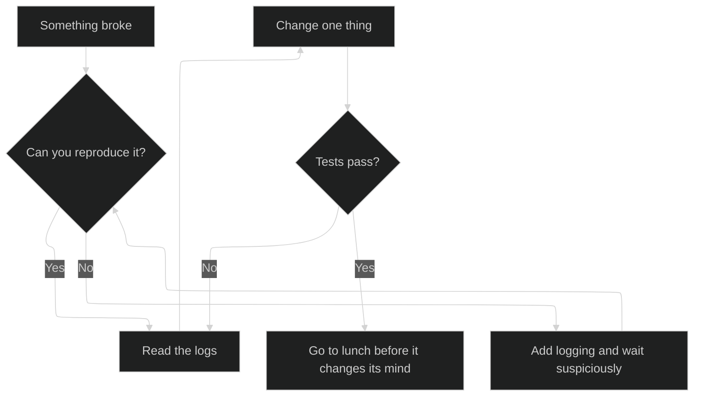
```mermaid
---
config:
  # Keep the example readable on a dark presentation canvas.
  theme: dark
  # Route the retry loop with ELK where supported.
  layout: elk
  # Match the exported image canvas to the theme.
  themeVariables:
    background: "#0b1120"
---
%% A debugging loop whose final dependency is often lunch.
flowchart TB
  DEBUG_FAILURE["Something broke"]
  DEBUG_REPRO{"Can you reproduce it?"}
  DEBUG_LOGS["Read the logs"]
  DEBUG_FIX["Change one thing"]
  DEBUG_PASS{"Tests pass?"}
  DEBUG_LUNCH["Go to lunch before it changes its mind"]
  DEBUG_OBSERVE["Add logging and wait suspiciously"]

  DEBUG_FAILURE --> DEBUG_REPRO
  DEBUG_REPRO -->|"Yes"| DEBUG_LOGS
  DEBUG_REPRO -->|"No"| DEBUG_OBSERVE
  DEBUG_OBSERVE --> DEBUG_REPRO
  DEBUG_LOGS --> DEBUG_FIX
  DEBUG_FIX --> DEBUG_PASS
  DEBUG_PASS -->|"No"| DEBUG_LOGS
  DEBUG_PASS -->|"Yes"| DEBUG_LUNCH
```

## 2. The cache has a cache

**Teaching point:** Subgraphs group ownership. The cylinder represents storage;
arrows describe the request path rather than physical cables.

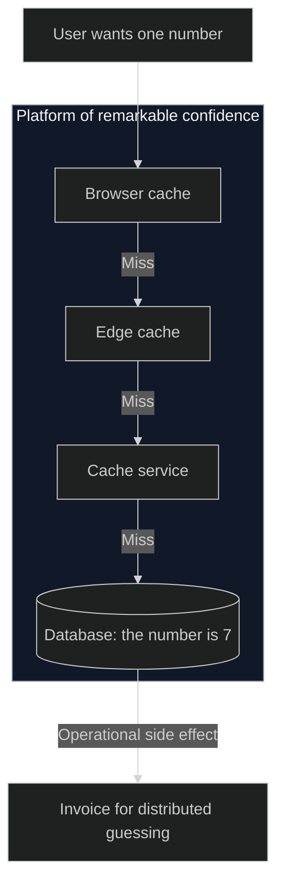
```mermaid
---
config:
  # Use a consistent dark theme across the presentation.
  theme: dark
  # Keep nested services inside their owning group.
  layout: elk
  # Match the export canvas.
  themeVariables:
    background: "#0b1120"
---
%% Every cache miss reveals another layer of optimism.
flowchart TB
  CACHE_USER["User wants one number"]
  subgraph SG_CACHE_PLATFORM["Platform of remarkable confidence"]
    CACHE_BROWSER["Browser cache"]
    CACHE_EDGE["Edge cache"]
    CACHE_SERVICE["Cache service"]
    CACHE_DATABASE[("Database: the number is 7")]
  end
  CACHE_BILL["Invoice for distributed guessing"]

  CACHE_USER --> CACHE_BROWSER
  CACHE_BROWSER -->|"Miss"| CACHE_EDGE
  CACHE_EDGE -->|"Miss"| CACHE_SERVICE
  CACHE_SERVICE -->|"Miss"| CACHE_DATABASE
  CACHE_DATABASE -->|"Operational side effect"| CACHE_BILL

  classDef groupPlatform fill:#111827,stroke:#94a3b8,color:#f1f5f9
  class SG_CACHE_PLATFORM groupPlatform
```

## 3. Documentation deployment pipeline

**Teaching point:** Branches can show two useful outputs from one source. A
separate status class adds a dashed border while preserving the node's role colors.

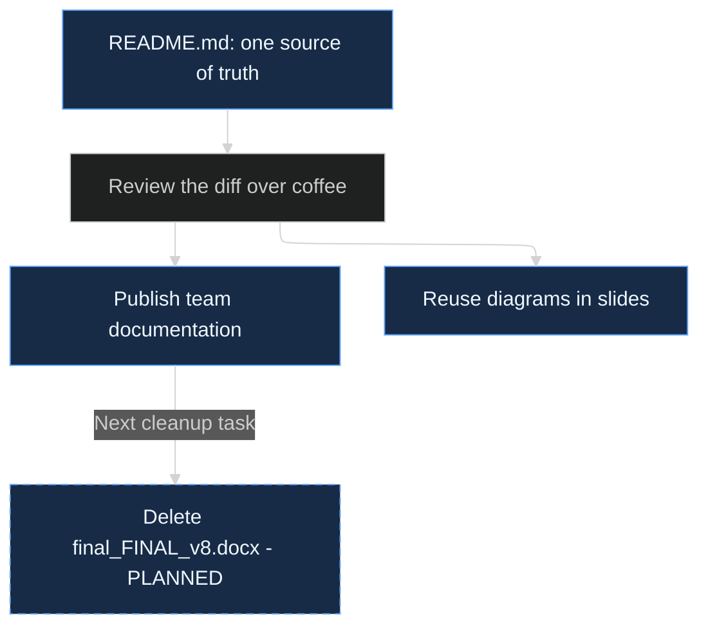
```mermaid
---
config:
  # Keep the source and published outputs visually consistent.
  theme: dark
  # Make the branch layout explicit.
  layout: elk
  # Match the export canvas.
  themeVariables:
    background: "#0b1120"
---
%% The future work is deleting the obsolete document, not writing a fifth copy.
flowchart TB
  DOC_SOURCE["README.md: one source of truth"]
  DOC_REVIEW["Review the diff over coffee"]
  DOC_WEB["Publish team documentation"]
  DOC_SLIDES["Reuse diagrams in slides"]
  DOC_RETIRE["Delete final_FINAL_v8.docx - PLANNED"]

  DOC_SOURCE --> DOC_REVIEW
  DOC_REVIEW --> DOC_WEB
  DOC_REVIEW --> DOC_SLIDES
  DOC_WEB -->|"Next cleanup task"| DOC_RETIRE

  classDef nodeArtifact fill:#172b46,stroke:#60a5fa,color:#eff6ff
  classDef statePending stroke-dasharray:6 4
  class DOC_SOURCE,DOC_WEB,DOC_SLIDES,DOC_RETIRE nodeArtifact
  class DOC_RETIRE statePending
```

The dashed border and the word **PLANNED** both identify future work.

## 4. Rubber duck as a service

**Teaching point:** A sequence diagram shows messages in time order. An `alt`
block captures alternative outcomes; a note adds context without inventing a message.

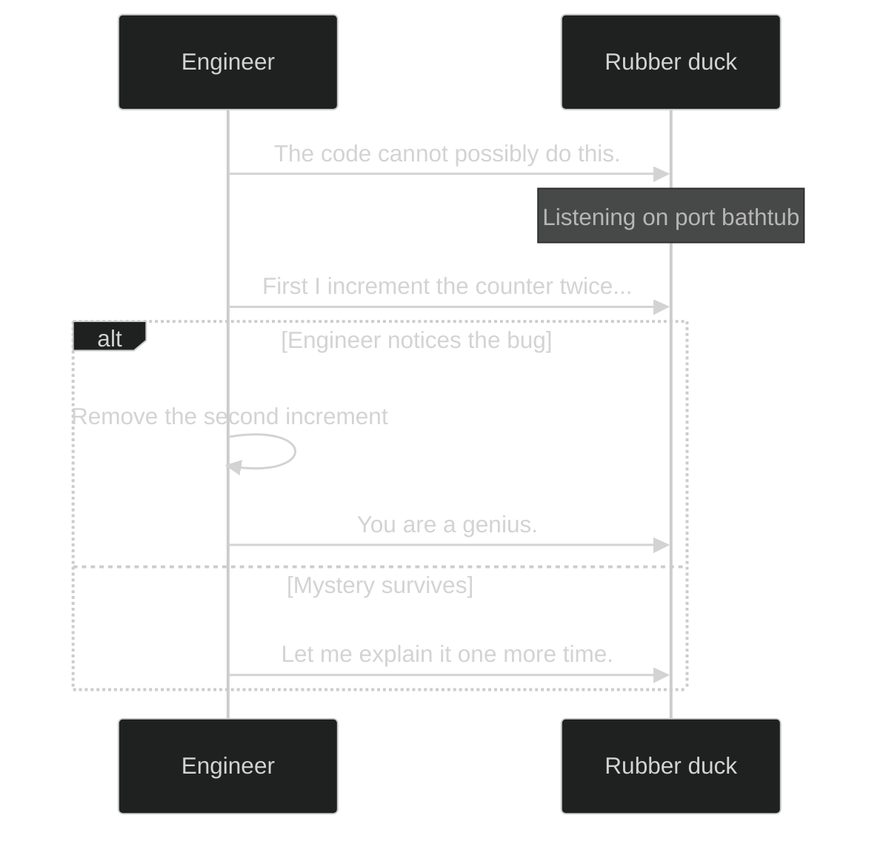
```mermaid
---
config:
  # Preserve the deck's dark theme.
  theme: dark
  # Match the export canvas.
  themeVariables:
    background: "#0b1120"
---
%% The duck has excellent uptime and no network interface.
sequenceDiagram
  participant DUCK_ENGINEER as Engineer
  participant DUCK_ADVISOR as Rubber duck
  DUCK_ENGINEER->>DUCK_ADVISOR: The code cannot possibly do this.
  Note over DUCK_ADVISOR: Listening on port bathtub
  DUCK_ENGINEER->>DUCK_ADVISOR: First I increment the counter twice...
  alt Engineer notices the bug
    DUCK_ENGINEER->>DUCK_ENGINEER: Remove the second increment
    DUCK_ENGINEER->>DUCK_ADVISOR: You are a genius.
  else Mystery survives
    DUCK_ENGINEER->>DUCK_ADVISOR: Let me explain it one more time.
  end
```

## 5. The meeting that could have been Markdown

**Teaching point:** A `loop` represents repetition. A self-message shows work
performed by one participant; dashed reply arrows show responses.

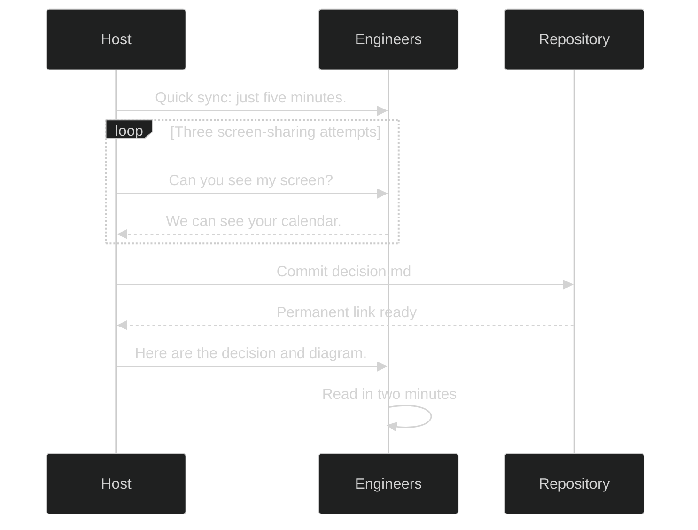
```mermaid
---
config:
  # Preserve the deck's dark theme.
  theme: dark
  # Match the export canvas.
  themeVariables:
    background: "#0b1120"
---
%% An expensive protocol discovers the humble link.
sequenceDiagram
  participant MEET_HOST as Host
  participant MEET_TEAM as Engineers
  participant MEET_REPO as Repository
  MEET_HOST->>MEET_TEAM: Quick sync: just five minutes.
  loop Three screen-sharing attempts
    MEET_HOST->>MEET_TEAM: Can you see my screen?
    MEET_TEAM-->>MEET_HOST: We can see your calendar.
  end
  MEET_HOST->>MEET_REPO: Commit decision.md
  MEET_REPO-->>MEET_HOST: Permanent link ready
  MEET_HOST->>MEET_TEAM: Here are the decision and diagram.
  MEET_TEAM->>MEET_TEAM: Read in two minutes
```

## 6. The lifecycle of a two-minute task

**Teaching point:** A state diagram describes an entity's lifecycle. The filled
circles mark the start and finish; transition labels explain what triggers a change.

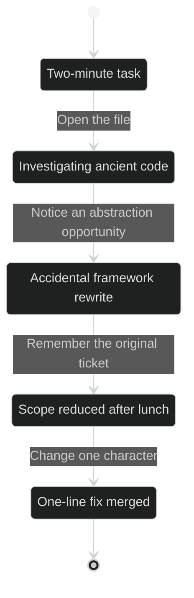
```mermaid
---
config:
  # Keep state labels readable with the presentation palette.
  theme: dark
  # Match the export canvas.
  themeVariables:
    background: "#0b1120"
---
%% The task finishes only after surviving its own scope.
stateDiagram-v2
  state "Two-minute task" as TASK_SMALL
  state "Investigating ancient code" as TASK_DIGGING
  state "Accidental framework rewrite" as TASK_REWRITE
  state "Scope reduced after lunch" as TASK_SCOPED
  state "One-line fix merged" as TASK_DONE

  [*] --> TASK_SMALL
  TASK_SMALL --> TASK_DIGGING: Open the file
  TASK_DIGGING --> TASK_REWRITE: Notice an abstraction opportunity
  TASK_REWRITE --> TASK_SCOPED: Remember the original ticket
  TASK_SCOPED --> TASK_DONE: Change one character
  TASK_DONE --> [*]
```

## 7. Enterprise-grade sandwich architecture

**Teaching point:** A class diagram documents structure. The hollow triangle
means inheritance; the filled diamond means composition. Multiplicities describe
how many objects participate in a relationship.

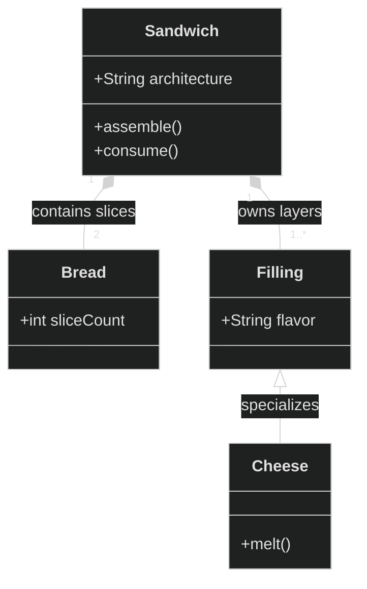
```mermaid
---
config:
  # Keep the architecture review appetizing and readable.
  theme: dark
  # Match the export canvas.
  themeVariables:
    background: "#0b1120"
---
%% A sandwich platform with a suspiciously large abstraction budget.
classDiagram
  class FOOD_SANDWICH["Sandwich"] {
    +String architecture
    +assemble()
    +consume()
  }
  class FOOD_BREAD["Bread"] {
    +int sliceCount
  }
  class FOOD_FILLING["Filling"] {
    +String flavor
  }
  class FOOD_CHEESE["Cheese"] {
    +melt()
  }

  FOOD_SANDWICH "1" *-- "2" FOOD_BREAD : contains slices
  FOOD_SANDWICH "1" *-- "1..*" FOOD_FILLING : owns layers
  FOOD_FILLING <|-- FOOD_CHEESE : specializes
```

## 8. The office snack database

**Teaching point:** An entity relationship diagram shows tables, keys, and
cardinality. A snack may have zero or many claims; every claim belongs to exactly
one engineer and one snack. Claims are intentions, so several can target the same snack.

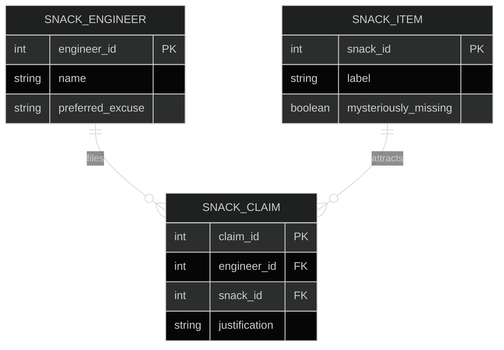
```mermaid
---
config:
  # Keep table labels consistent with the presentation.
  theme: dark
  # Match the export canvas.
  themeVariables:
    background: "#0b1120"
---
%% Normalization cannot prevent someone from eating the evidence.
erDiagram
  SNACK_ENGINEER {
    int engineer_id PK
    string name
    string preferred_excuse
  }
  SNACK_ITEM {
    int snack_id PK
    string label
    boolean mysteriously_missing
  }
  SNACK_CLAIM {
    int claim_id PK
    int engineer_id FK
    int snack_id FK
    string justification
  }

  SNACK_ENGINEER ||--o{ SNACK_CLAIM : files
  SNACK_ITEM ||--o{ SNACK_CLAIM : attracts
```

## 9. The five-minute change: project plan

**Teaching point:** A Gantt chart shows durations and dependencies. `after`
references a stable task ID; a milestone has zero duration. These are calendar days.

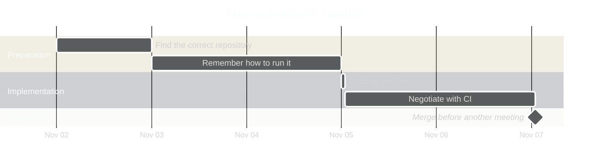
```mermaid
---
config:
  # Keep the schedule readable on the same dark canvas.
  theme: dark
  # Match the export canvas.
  themeVariables:
    background: "#0b1120"
---
%% Fictional schedule: the code change is the shortest part.
gantt
  title The five-minute change
  dateFormat YYYY-MM-DD
  axisFormat %b %d
  tickInterval 1day
  section Preparation
    Find the correct repository :PLAN_FIND, 2026-11-02, 1d
    Remember how to run it :PLAN_RUN, after PLAN_FIND, 2d
  section Implementation
    Change one line :PLAN_EDIT, after PLAN_RUN, 1h
    Negotiate with CI :PLAN_CI, after PLAN_EDIT, 2d
  section Celebration
    Merge before another meeting :milestone, PLAN_MERGE, after PLAN_CI, 0d
```

## 10. Where the debugging time went

**Teaching point:** A pie chart compares parts of a whole. Quoted labels and
numeric values are enough; `showData` displays the values in the legend.

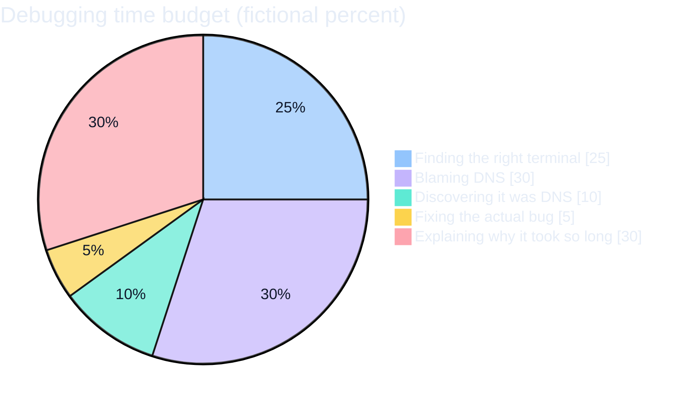
```mermaid
---
config:
  # Use the same presentation theme for the chart.
  theme: base
  # Match the export canvas.
  themeVariables:
    background: "#0b1120"
    # Pair bright slices with dark labels and light legend text.
    darkMode: true
    textColor: "#e6edf7"
    pie1: "#93c5fd"
    pie2: "#c4b5fd"
    pie3: "#5eead4"
    pie4: "#fcd34d"
    pie5: "#fda4af"
    pieSectionTextColor: "#0f172a"
    pieLegendTextColor: "#e6edf7"
    pieTitleTextColor: "#e6edf7"
---
%% Invented percentages; suspiciously plausible is not measured.
pie showData
  title Debugging time budget (fictional percent)
  "Finding the right terminal" : 25
  "Blaming DNS" : 30
  "Discovering it was DNS" : 10
  "Fixing the actual bug" : 5
  "Explaining why it took so long" : 30
```

## 11. An engineer's emotional deployment journey

**Teaching point:** A journey diagram groups tasks into phases. Scores range
from 1 (low) to 5 (high); actor names identify who shares each experience.

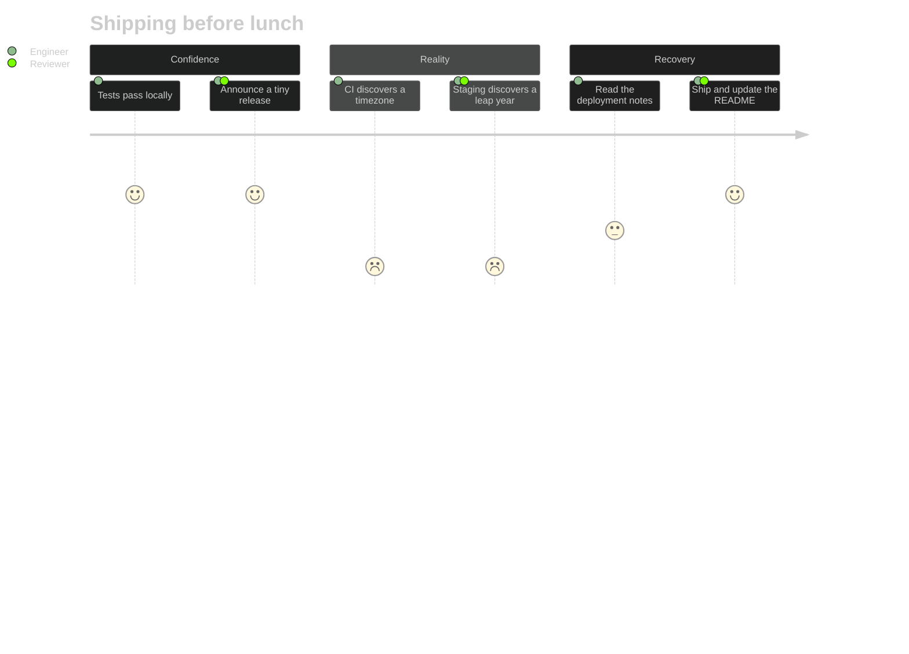
```mermaid
---
config:
  # Keep the journey consistent with the presentation.
  theme: dark
  # Match the export canvas.
  themeVariables:
    background: "#0b1120"
---
%% These scores measure fictional morale, not service health.
journey
  title Shipping before lunch
  section Confidence
    Tests pass locally: 5: Engineer
    Announce a tiny release: 5: Engineer, Reviewer
  section Reality
    CI discovers a timezone: 1: Engineer
    Staging discovers a leap year: 1: Engineer, Reviewer
  section Recovery
    Read the deployment notes: 3: Engineer
    Ship and update the README: 5: Engineer, Reviewer
```

## 12. Naming things: the hardest architecture review

**Teaching point:** A mind map captures a hierarchy without inventing process
arrows. Indentation determines parentage; explicit IDs keep labels editable.
This example uses CSS named colors throughout; export it with a `midnightblue` canvas.

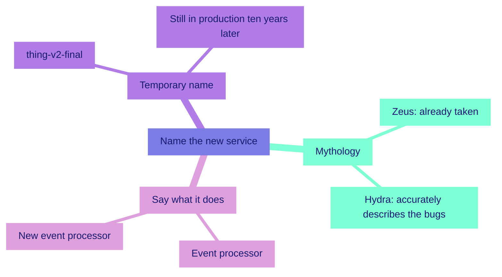
```mermaid
---
config:
  # Keep the brainstorming map consistent with the deck.
  theme: base
  # Export this diagram with a midnightblue canvas.
  themeVariables:
    background: midnightblue
    # Light node fills and dark text keep every branch readable.
    primaryColor: lavender
    primaryTextColor: midnightblue
    primaryBorderColor: slategray
    lineColor: slategray
    cScale0: lightskyblue
    cScale1: aquamarine
    cScale2: plum
    cScaleLabel0: midnightblue
    cScaleLabel1: midnightblue
    cScaleLabel2: midnightblue
---
%% Every naming branch ends in a familiar maintenance burden.
mindmap
  NAME_ROOT["Name the new service"]
    NAME_MYTH["Mythology"]
      NAME_ZEUS["Zeus: already taken"]
      NAME_HYDRA["Hydra: accurately describes the bugs"]
    NAME_LITERAL["Say what it does"]
      NAME_PROCESSOR["Event processor"]
      NAME_PROCESSOR_NEW["New event processor"]
    NAME_TEMP["Temporary name"]
      NAME_TEMP_FINAL["thing-v2-final"]
      NAME_TEMP_FOREVER["Still in production ten years later"]
```

## 13. Requirements telephone

**Teaching point:** Sequence messages reveal where an assumption enters a conversation. Responses make the mismatch visible before implementation.

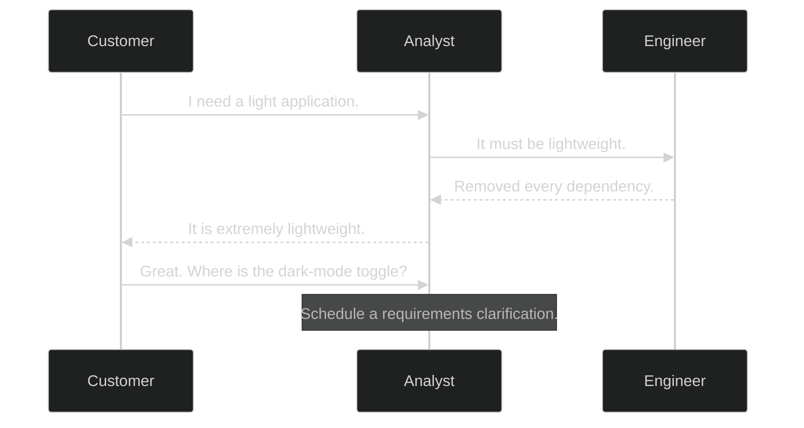
```mermaid
---
config:
  # Keep this example consistent with the dark presentation.
  theme: dark
  # Match the image export canvas.
  themeVariables:
    background: "#0b1120"
---
%% Each handoff preserves confidence better than meaning.
sequenceDiagram
  participant REQ_CUSTOMER as Customer
  participant REQ_ANALYST as Analyst
  participant REQ_ENGINEER as Engineer
  REQ_CUSTOMER->>REQ_ANALYST: I need a light application.
  REQ_ANALYST->>REQ_ENGINEER: It must be lightweight.
  REQ_ENGINEER-->>REQ_ANALYST: Removed every dependency.
  REQ_ANALYST-->>REQ_CUSTOMER: It is extremely lightweight.
  REQ_CUSTOMER->>REQ_ANALYST: Great. Where is the dark-mode toggle?
  Note over REQ_ANALYST: Schedule a requirements clarification.
```

## 14. Requirements freeze, now with a defrost cycle

**Teaching point:** Decision nodes distinguish approved changes from clarification. A loop shows why an approval process still needs an exit.

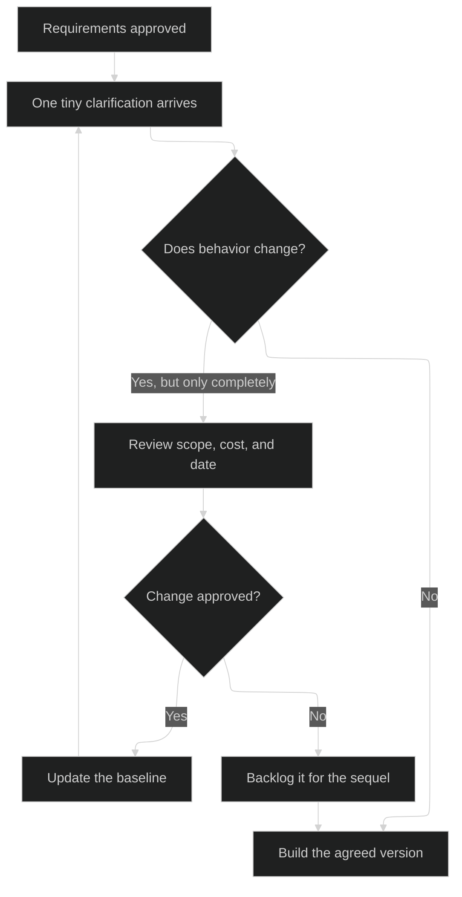
```mermaid
---
config:
  # Keep this example consistent with the dark presentation.
  theme: dark
  # Keep flowchart groups and branches predictable where supported.
  layout: elk
  # Match the image export canvas.
  themeVariables:
    background: "#0b1120"
---
%% The freezer is working; someone keeps opening the door.
flowchart TB
  FREEZE_BASELINE["Requirements approved"]
  FREEZE_REQUEST["One tiny clarification arrives"]
  FREEZE_CHANGE{"Does behavior change?"}
  FREEZE_REVIEW["Review scope, cost, and date"]
  FREEZE_APPROVED{"Change approved?"}
  FREEZE_UPDATE["Update the baseline"]
  FREEZE_BACKLOG["Backlog it for the sequel"]
  FREEZE_SHIP["Build the agreed version"]

  FREEZE_BASELINE --> FREEZE_REQUEST
  FREEZE_REQUEST --> FREEZE_CHANGE
  FREEZE_CHANGE -->|"No"| FREEZE_SHIP
  FREEZE_CHANGE -->|"Yes, but only completely"| FREEZE_REVIEW
  FREEZE_REVIEW --> FREEZE_APPROVED
  FREEZE_APPROVED -->|"Yes"| FREEZE_UPDATE
  FREEZE_APPROVED -->|"No"| FREEZE_BACKLOG
  FREEZE_UPDATE --> FREEZE_REQUEST
  FREEZE_BACKLOG --> FREEZE_SHIP
```

## 15. More engineers, faster onboarding meetings

**Teaching point:** Independent Gantt sections can compare hypothetical staffing scenarios with the same start date. Dependencies show when work must wait.

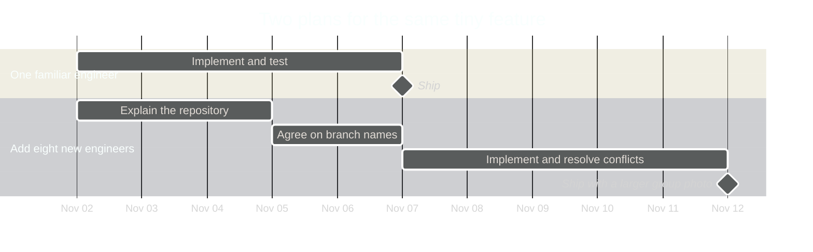
```mermaid
---
config:
  # Keep this example consistent with the dark presentation.
  theme: dark
  # Match the image export canvas.
  themeVariables:
    background: "#0b1120"
---
%% Invented durations illustrate coordination cost, not a staffing forecast.
gantt
  title Two plans for the same tiny feature
  dateFormat YYYY-MM-DD
  axisFormat %b %d
  tickInterval 1day
  section One familiar engineer
    Implement and test :STAFF_SOLO, 2026-11-02, 5d
    Ship :milestone, STAFF_SOLO_SHIP, after STAFF_SOLO, 0d
  section Add eight new engineers
    Explain the repository :STAFF_ORIENT, 2026-11-02, 3d
    Agree on branch names :STAFF_BRANCH, after STAFF_ORIENT, 2d
    Implement and resolve conflicts :STAFF_BUILD, after STAFF_BRANCH, 5d
    Ship with a larger group photo :milestone, STAFF_GROUP_SHIP, after STAFF_BUILD, 0d
```

## 16. Parallel requests, serial human

**Teaching point:** A sequence diagram can show concurrent requests with `par` and `and`. Concurrent arrivals do not imply that one engineer can execute them simultaneously.

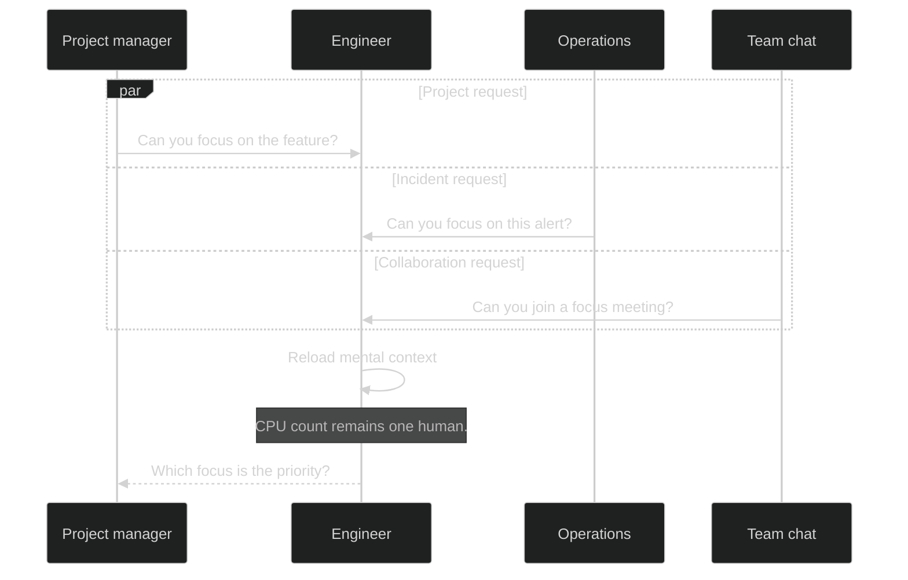
```mermaid
---
config:
  # Keep this example consistent with the dark presentation.
  theme: dark
  # Match the image export canvas.
  themeVariables:
    background: "#0b1120"
---
%% Three channels discover the same available engineer.
sequenceDiagram
  participant FOCUS_PM as Project manager
  participant FOCUS_ENGINEER as Engineer
  participant FOCUS_OPS as Operations
  participant FOCUS_CHAT as Team chat
  par Project request
    FOCUS_PM->>FOCUS_ENGINEER: Can you focus on the feature?
  and Incident request
    FOCUS_OPS->>FOCUS_ENGINEER: Can you focus on this alert?
  and Collaboration request
    FOCUS_CHAT->>FOCUS_ENGINEER: Can you join a focus meeting?
  end
  FOCUS_ENGINEER->>FOCUS_ENGINEER: Reload mental context
  Note over FOCUS_ENGINEER: CPU count remains one human.
  FOCUS_ENGINEER-->>FOCUS_PM: Which focus is the priority?
```

## 17. Traceability to the one laptop

**Teaching point:** A requirement diagram links a requirement to its implementation and verification evidence. The deliberately narrow requirement exposes the portability gap.

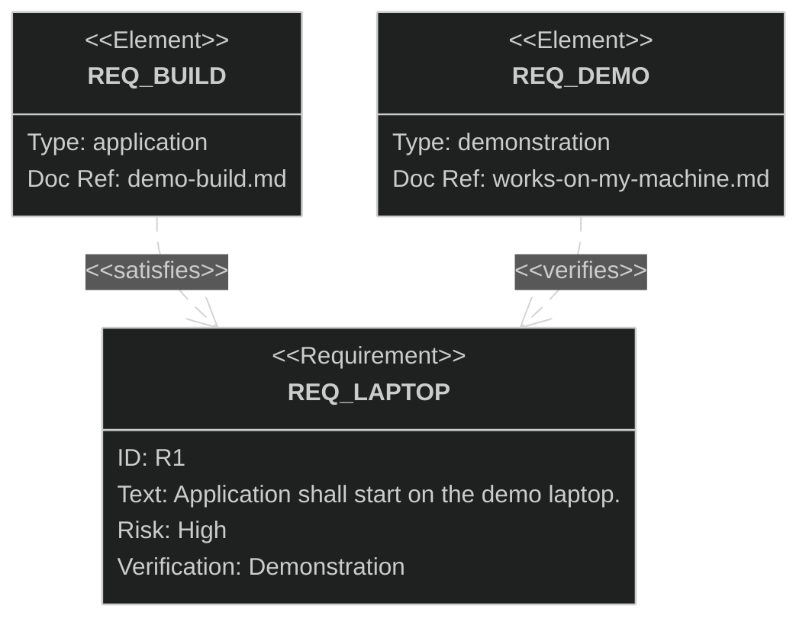
```mermaid
---
config:
  # Keep this example consistent with the dark presentation.
  theme: dark
  # Match the image export canvas.
  themeVariables:
    background: "#0b1120"
---
%% A passing demonstration proves only the requirement that was written.
requirementDiagram
  requirement REQ_LAPTOP {
    id: R1
    text: "Application shall start on the demo laptop."
    risk: high
    verifymethod: demonstration
  }
  element REQ_BUILD {
    type: "application"
    docref: "demo-build.md"
  }
  element REQ_DEMO {
    type: "demonstration"
    docref: "works-on-my-machine.md"
  }

  REQ_BUILD - satisfies -> REQ_LAPTOP
  REQ_DEMO - verifies -> REQ_LAPTOP
```

Passing this demonstration says nothing about other laptops. Add portability
requirements and their own verification evidence when portability matters.

## 18. The temporary workaround retirement plan

**Teaching point:** State transitions can include a return to an earlier state. The final state makes the actual retirement condition explicit.

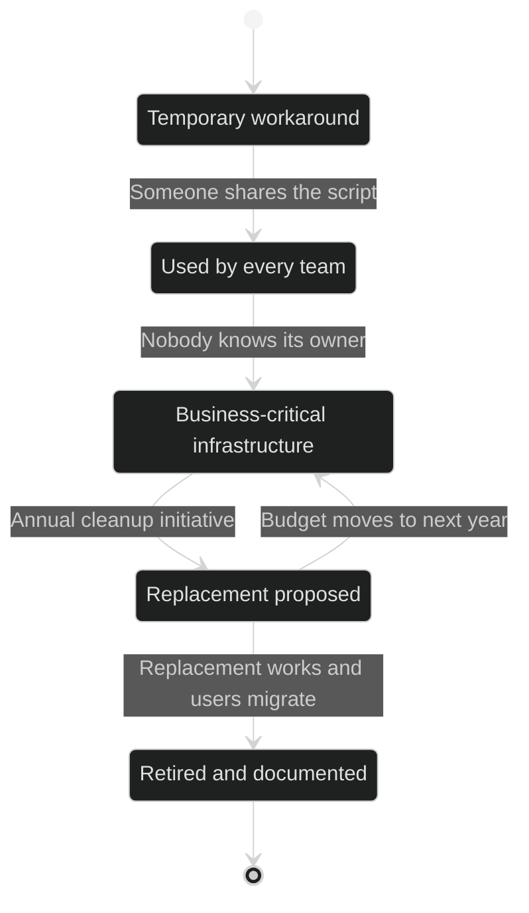
```mermaid
---
config:
  # Keep this example consistent with the dark presentation.
  theme: dark
  # Match the image export canvas.
  themeVariables:
    background: "#0b1120"
---
%% Temporary is a lifecycle stage with a surprisingly long lease.
stateDiagram-v2
  state "Temporary workaround" as WORKAROUND_TEMP
  state "Used by every team" as WORKAROUND_SHARED
  state "Business-critical infrastructure" as WORKAROUND_CRITICAL
  state "Replacement proposed" as WORKAROUND_REPLACE
  state "Retired and documented" as WORKAROUND_RETIRED

  [*] --> WORKAROUND_TEMP
  WORKAROUND_TEMP --> WORKAROUND_SHARED: Someone shares the script
  WORKAROUND_SHARED --> WORKAROUND_CRITICAL: Nobody knows its owner
  WORKAROUND_CRITICAL --> WORKAROUND_REPLACE: Annual cleanup initiative
  WORKAROUND_REPLACE --> WORKAROUND_CRITICAL: Budget moves to next year
  WORKAROUND_REPLACE --> WORKAROUND_RETIRED: Replacement works and users migrate
  WORKAROUND_RETIRED --> [*]
```

## 19. A factory for manufacturing factories

**Teaching point:** A class dependency arrow means one class uses another. A creation dependency does not claim inheritance or ownership.

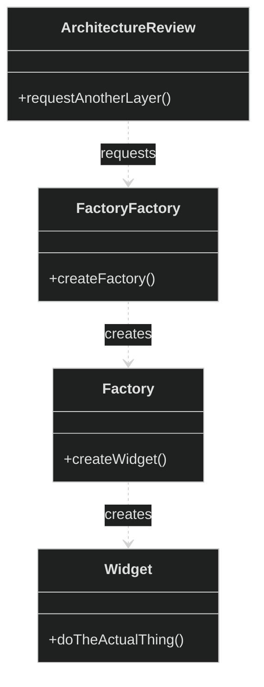
```mermaid
---
config:
  # Keep this example consistent with the dark presentation.
  theme: dark
  # Match the image export canvas.
  themeVariables:
    background: "#0b1120"
---
%% Abstraction has become the primary manufactured product.
classDiagram
  class BUILD_FACTORY_FACTORY["FactoryFactory"] {
    +createFactory()
  }
  class BUILD_FACTORY["Factory"] {
    +createWidget()
  }
  class BUILD_WIDGET["Widget"] {
    +doTheActualThing()
  }
  class BUILD_REVIEW["ArchitectureReview"] {
    +requestAnotherLayer()
  }

  BUILD_FACTORY_FACTORY ..> BUILD_FACTORY : creates
  BUILD_FACTORY ..> BUILD_WIDGET : creates
  BUILD_REVIEW ..> BUILD_FACTORY_FACTORY : requests
```

## 20. The staffing spreadsheet discovered cloning

**Teaching point:** An associative entity models a many-to-many relationship. Cardinality does not enforce a sum across rows: capacity needs a separate business rule.

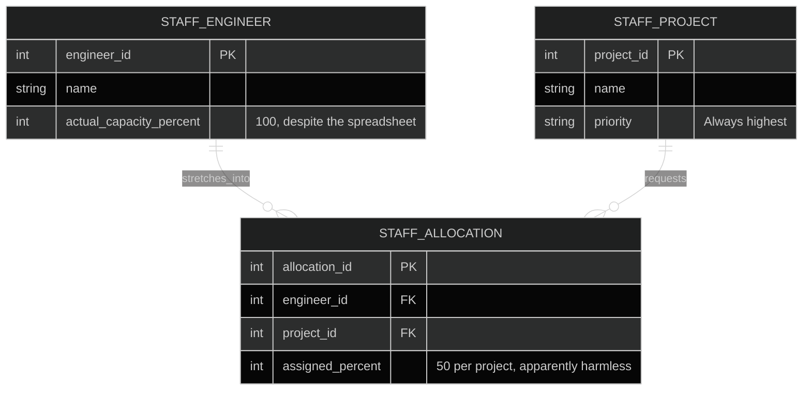
```mermaid
---
config:
  # Keep this example consistent with the dark presentation.
  theme: dark
  # Match the image export canvas.
  themeVariables:
    background: "#0b1120"
---
%% Three allocations of 50 percent do not create half an extra engineer.
erDiagram
  STAFF_ENGINEER {
    int engineer_id PK
    string name
    int actual_capacity_percent "100, despite the spreadsheet"
  }
  STAFF_PROJECT {
    int project_id PK
    string name
    string priority "Always highest"
  }
  STAFF_ALLOCATION {
    int allocation_id PK
    int engineer_id FK
    int project_id FK
    int assigned_percent "50 per project, apparently harmless"
  }

  STAFF_ENGINEER ||--o{ STAFF_ALLOCATION : stretches_into
  STAFF_PROJECT ||--o{ STAFF_ALLOCATION : requests
```

For example, assigning one engineer to three projects at 50% each totals 150%.
The database needs a capacity check; a crow's-foot connector cannot enforce it.

## 21. The universal standard recruitment drive

**Teaching point:** A timeline orders labeled periods and their events. Unlike a Gantt chart, it does not calculate duration or dependencies.

```mermaid
---
config:
  # Keep this example consistent with the dark presentation.
  theme: dark
  # Match the image export canvas.
  themeVariables:
    background: "#0b1120"
---
%% The committee succeeds at increasing the number of standards.
timeline
  title One standard to unite them all
  Week 1 : Discover fourteen competing standards
  Week 2 : Form a committee to simplify things
  Week 3 : Publish the universal replacement
  Week 4 : Support fifteen competing standards
```

## 22. Automating a five-second task

**Teaching point:** A feedback loop can model repeated investment. A decision gives the loop an exit rather than implying that improvement must continue forever.

```mermaid
---
config:
  # Keep this example consistent with the dark presentation.
  theme: dark
  # Keep flowchart groups and branches predictable where supported.
  layout: elk
  # Match the image export canvas.
  themeVariables:
    background: "#0b1120"
---
%% The calculator is the only component with a positive return so far.
flowchart TB
  AUTO_TASK["Manual task takes five seconds"]
  AUTO_SCRIPT["Spend a day automating it"]
  AUTO_DEPENDENCY["Add configuration and dependencies"]
  AUTO_BROKEN["Automation needs maintenance"]
  AUTO_CALCULATE["Calculate the break-even date"]
  AUTO_WORTH{"Will we run it that often?"}
  AUTO_KEEP["Keep it simple and document it"]

  AUTO_TASK --> AUTO_SCRIPT
  AUTO_SCRIPT --> AUTO_DEPENDENCY
  AUTO_DEPENDENCY --> AUTO_BROKEN
  AUTO_BROKEN --> AUTO_CALCULATE
  AUTO_CALCULATE --> AUTO_WORTH
  AUTO_WORTH -->|"Yes, fix it"| AUTO_SCRIPT
  AUTO_WORTH -->|"No, not before retirement"| AUTO_KEEP
```

## 23. High availability, except during Pat's vacation

**Teaching point:** Named edges allow styling by meaning. A dotted arrow shows a knowledge dependency; it does not represent a redundant network link.

```mermaid
---
config:
  # Keep this example consistent with the dark presentation.
  theme: dark
  # Keep flowchart groups and branches predictable where supported.
  layout: elk
  # Match the image export canvas.
  themeVariables:
    background: "#0b1120"
---
%% Three replicas still depend on one person's memory.
flowchart TB
  subgraph SG_VACATION_PLATFORM["Highly available platform"]
    VACATION_SERVICE_01["Service replica 1"]
    VACATION_SERVICE_02["Service replica 2"]
    VACATION_SERVICE_03["Service replica 3"]
  end
  VACATION_PAT["Pat: remembers the recovery command"]
  VACATION_RUNBOOK["Runbook: ask Pat"]

  VACATION_SERVICE_01 edge_replica_01_pat_knowledge@-.->|"Recovery knowledge"| VACATION_PAT
  VACATION_SERVICE_02 edge_replica_02_pat_knowledge@-.->|"Recovery knowledge"| VACATION_PAT
  VACATION_SERVICE_03 edge_replica_03_pat_knowledge@-.->|"Recovery knowledge"| VACATION_PAT
  VACATION_RUNBOOK edge_runbook_pat_knowledge@-.->|"Escalation procedure"| VACATION_PAT

  classDef groupPlatform fill:#111827,stroke:#94a3b8,color:#f1f5f9
  classDef edgeKnowledge stroke:#fbbf24,stroke-width:2px,stroke-dasharray:3 3
  class SG_VACATION_PLATFORM groupPlatform
  class edge_replica_01_pat_knowledge,edge_replica_02_pat_knowledge,edge_replica_03_pat_knowledge edgeKnowledge
  class edge_runbook_pat_knowledge edgeKnowledge
```

**Legend:** dotted amber arrows show dependence on recovery knowledge.
The platform boundary groups services; it does not imply independent operators.

## 24. The architecture review has reached the color phase

**Teaching point:** Mermaid styles accept CSS named colors and hex values.
Each connected pair below has identical fill, border, and text colors; only the
notation changes. The association lines mean **same colors**, with no process order.

```mermaid
---
config:
  # Base supports the explicit palette used in this color demonstration.
  theme: base
  # Keep the equivalence pairs together where supported.
  layout: elk
  # Use light labels and connectors against the dark export canvas.
  themeVariables:
    background: "#0b1120"
    darkMode: true
    textColor: "#e6edf7"
    lineColor: "#94a3b8"
    edgeLabelBackground: "#111827"
---
%% Two spellings of each palette; neither fixes the release date.
flowchart TB
  COLOR_BUDGET_NAMED["gold: budget optimism"]
  COLOR_BUDGET_HEX["#ffd700: identical optimism"]
  COLOR_RELEASE_NAMED["tomato: deployment blush"]
  COLOR_RELEASE_HEX["#ff6347: identical blush"]

  COLOR_BUDGET_NAMED ---|"Same colors"| COLOR_BUDGET_HEX
  COLOR_RELEASE_NAMED ---|"Same colors"| COLOR_RELEASE_HEX

  %% Meaningful class names describe the subject and notation, not just paint.
  classDef nodeBudgetNamed fill:gold,stroke:darkslategray,color:midnightblue,stroke-width:3px
  classDef nodeBudgetHex fill:#ffd700,stroke:#2f4f4f,color:#191970,stroke-width:3px
  classDef nodeReleaseNamed fill:tomato,stroke:darkslategray,color:midnightblue,stroke-width:3px
  classDef nodeReleaseHex fill:#ff6347,stroke:#2f4f4f,color:#191970,stroke-width:3px

  class COLOR_BUDGET_NAMED nodeBudgetNamed
  class COLOR_BUDGET_HEX nodeBudgetHex
  class COLOR_RELEASE_NAMED nodeReleaseNamed
  class COLOR_RELEASE_HEX nodeReleaseHex
```

The names come from the web platform's **CSS named-color keywords**, standardized
in the [W3C CSS Color specification](https://www.w3.org/TR/css-color-4/#named-colors).
Browsers recognize those keywords when they render Mermaid's SVG styles. Mermaid
uses that vocabulary; these are not names defined by a Mermaid theme or class.
The specification's table is a reference for the available names and their values.

| CSS name | Equivalent hex | Use in this example |
| --- | --- | --- |
| `gold` | `#ffd700` | Budget node fill |
| `tomato` | `#ff6347` | Release node fill |
| `darkslategray` | `#2f4f4f` | Node border (`stroke`) |
| `midnightblue` | `#191970` | Node text (`color`) |

In six-digit hex notation, `#RRGGBB` gives the red, green, and blue channels as
hexadecimal pairs from `00` to `ff`. Named colors are convenient predefined values;
hex lets you specify other colors, such as an exact brand palette.

In YAML front matter, quote hex values, as in `background: "#0b1120"`: an unquoted
`#` begins a YAML comment. In a Mermaid `classDef`, write the hex value directly,
as in `fill:#ffd700`. `fill` colors the shape, `stroke` colors its outline, and
`color` colors its text. Assign the class separately so label and style edits stay
independent in a Markdown diff.

Choose readable text and fill combinations, and retain meaningful labels or line
patterns so color is never the only way to understand the diagram. The release date
remains unchanged, even if the committee unanimously approves `tomato`.

## 25. Server room floor plan: the cold aisle has fans

**Teaching point:** A block diagram places items in a grid. `columns 4` defines
four columns; `:4` makes a block span the entire row. This is physical placement,
so no arrows are needed to imply network connections.

Illustrative top-down layout, with north at the top, **not to scale**. Rack fronts
face the central cold aisle; rears face the outer hot aisles. The cooling-unit
block is a location marker, not an airflow simulation. A real plan needs measured
clearances, door swings, cable routes, and site-specific power and cooling details.

```mermaid
---
config:
  # Base lets the physical zones use explicit, readable colors.
  theme: base
  # Give unstyled labels a readable fallback on the export canvas.
  themeVariables:
    background: "#0b1120"
    primaryColor: "#172b46"
    primaryTextColor: "#eff6ff"
    primaryBorderColor: "#94a3b8"
---
%% Top-down placement only; the floor tiles are not a subnet mask.
block-beta
  columns 4
  FLOOR_NORTH["NORTH WALL - cooling units / return air"]:4
  FLOOR_HOT_NORTH["HOT AISLE - rack rears face this aisle"]:4
  FLOOR_RACK_A01["A01: rear up / front down"]
  FLOOR_RACK_A02["A02: rear up / front down"]
  FLOOR_RACK_A03["A03: rear up / front down"]
  FLOOR_RACK_A04["A04: rear up / front down"]
  FLOOR_COLD["COLD AISLE - rack fronts face each other; bring a sweater"]:4
  FLOOR_RACK_B01["B01: front up / rear down"]
  FLOOR_RACK_B02["B02: front up / rear down"]
  FLOOR_RACK_B03["B03: front up / rear down"]
  FLOOR_RACK_B04["B04: front up / rear down"]
  FLOOR_HOT_SOUTH["HOT AISLE - rack rears face this aisle"]:4
  FLOOR_ENTRY["Entry / exit"]
  FLOOR_WORKBENCH["Work bench - coffee stays outside"]:2
  FLOOR_ACCESS["Service access"]

  classDef nodeRack fill:#172b46,stroke:#60a5fa,color:#eff6ff
  classDef nodeColdAisle fill:#12313d,stroke:#22d3ee,color:#ecfeff
  classDef nodeHotAisle fill:#48251b,stroke:#fb923c,color:#fff7ed
  classDef nodeFacility fill:#29213f,stroke:#a78bfa,color:#f5f3ff

  class FLOOR_RACK_A01,FLOOR_RACK_A02,FLOOR_RACK_A03,FLOOR_RACK_A04 nodeRack
  class FLOOR_RACK_B01,FLOOR_RACK_B02,FLOOR_RACK_B03,FLOOR_RACK_B04 nodeRack
  class FLOOR_COLD nodeColdAisle
  class FLOOR_HOT_NORTH,FLOOR_HOT_SOUTH nodeHotAisle
  class FLOOR_NORTH,FLOOR_ENTRY,FLOOR_WORKBENCH,FLOOR_ACCESS nodeFacility
```

**Legend:** labeled blue blocks are racks; cyan marks the cold aisle; orange marks
hot aisles; purple marks facility areas. The text identifies each zone independently
of color. `A01` is the rack expanded in the next example.

## 26. Rack A01: 42U of opportunity, zero U for a coffee cup

**Teaching point:** A single-column block diagram makes a rack elevation. Each
node below represents exactly one rack unit, including each part of a multi-U
device. U42 is at the top and U01 is at the bottom; labels identify which device
occupies each position. This is a **front view**, not a cable or airflow diagram.

Every U position is shown. There are **26U available**: U05-U29 form a contiguous
25U run, and U40 is a separate 1U opening. Available slots may have removable
blanking panels; the label describes capacity, not an instruction to leave them open.

```mermaid
---
config:
  # Base supports explicit device, power, and free-space colors.
  theme: base
  # Keep every slot readable on the dark canvas.
  themeVariables:
    background: "#0b1120"
    primaryColor: "#172b46"
    primaryTextColor: "#eff6ff"
    primaryBorderColor: "#60a5fa"
---
%% One row per U. Update labels and class assignments together when racking gear.
block-beta
  columns 1
  RACK_A01_U42["U42 - Patch panel (1U)"]
  RACK_A01_U41["U41 - Network switch (1U)"]
  RACK_A01_U40["U40 - AVAILABLE"]
  RACK_A01_U39["U39 - Cable manager (1U)"]
  RACK_A01_U38["U38 - Server 01 (2U, top)"]
  RACK_A01_U37["U37 - Server 01 (2U, bottom)"]
  RACK_A01_U36["U36 - Server 02 (2U, top)"]
  RACK_A01_U35["U35 - Server 02 (2U, bottom)"]
  RACK_A01_U34["U34 - Management appliance (1U)"]
  RACK_A01_U33["U33 - Storage array (4U, top)"]
  RACK_A01_U32["U32 - Storage array (4U, part 2)"]
  RACK_A01_U31["U31 - Storage array (4U, part 3)"]
  RACK_A01_U30["U30 - Storage array (4U, bottom)"]
  RACK_A01_U29["U29 - AVAILABLE"]
  RACK_A01_U28["U28 - AVAILABLE"]
  RACK_A01_U27["U27 - AVAILABLE"]
  RACK_A01_U26["U26 - AVAILABLE"]
  RACK_A01_U25["U25 - AVAILABLE"]
  RACK_A01_U24["U24 - AVAILABLE"]
  RACK_A01_U23["U23 - AVAILABLE"]
  RACK_A01_U22["U22 - AVAILABLE"]
  RACK_A01_U21["U21 - AVAILABLE"]
  RACK_A01_U20["U20 - AVAILABLE"]
  RACK_A01_U19["U19 - AVAILABLE"]
  RACK_A01_U18["U18 - AVAILABLE"]
  RACK_A01_U17["U17 - AVAILABLE"]
  RACK_A01_U16["U16 - AVAILABLE"]
  RACK_A01_U15["U15 - AVAILABLE"]
  RACK_A01_U14["U14 - AVAILABLE"]
  RACK_A01_U13["U13 - AVAILABLE"]
  RACK_A01_U12["U12 - AVAILABLE"]
  RACK_A01_U11["U11 - AVAILABLE"]
  RACK_A01_U10["U10 - AVAILABLE"]
  RACK_A01_U09["U09 - AVAILABLE"]
  RACK_A01_U08["U08 - AVAILABLE"]
  RACK_A01_U07["U07 - AVAILABLE"]
  RACK_A01_U06["U06 - AVAILABLE"]
  RACK_A01_U05["U05 - AVAILABLE"]
  RACK_A01_U04["U04 - UPS (4U, top)"]
  RACK_A01_U03["U03 - UPS (4U, part 2)"]
  RACK_A01_U02["U02 - UPS (4U, part 3)"]
  RACK_A01_U01["U01 - UPS (4U, bottom)"]

  classDef nodeDevice fill:#172b46,stroke:#60a5fa,color:#eff6ff
  classDef nodeAvailable fill:#113832,stroke:#2dd4bf,color:#f0fdfa
  classDef nodePower fill:#29213f,stroke:#a78bfa,color:#f5f3ff
  classDef stateAvailable stroke-dasharray:6 4

  class RACK_A01_U42,RACK_A01_U41,RACK_A01_U39,RACK_A01_U38,RACK_A01_U37,RACK_A01_U36,RACK_A01_U35,RACK_A01_U34,RACK_A01_U33,RACK_A01_U32,RACK_A01_U31,RACK_A01_U30 nodeDevice
  class RACK_A01_U40,RACK_A01_U29,RACK_A01_U28,RACK_A01_U27,RACK_A01_U26,RACK_A01_U25,RACK_A01_U24,RACK_A01_U23,RACK_A01_U22,RACK_A01_U21,RACK_A01_U20,RACK_A01_U19,RACK_A01_U18,RACK_A01_U17,RACK_A01_U16,RACK_A01_U15,RACK_A01_U14,RACK_A01_U13,RACK_A01_U12,RACK_A01_U11,RACK_A01_U10,RACK_A01_U09,RACK_A01_U08,RACK_A01_U07,RACK_A01_U06,RACK_A01_U05 nodeAvailable
  class RACK_A01_U04,RACK_A01_U03,RACK_A01_U02,RACK_A01_U01 nodePower
  class RACK_A01_U40,RACK_A01_U29,RACK_A01_U28,RACK_A01_U27,RACK_A01_U26,RACK_A01_U25,RACK_A01_U24,RACK_A01_U23,RACK_A01_U22,RACK_A01_U21,RACK_A01_U20,RACK_A01_U19,RACK_A01_U18,RACK_A01_U17,RACK_A01_U16,RACK_A01_U15,RACK_A01_U14,RACK_A01_U13,RACK_A01_U12,RACK_A01_U11,RACK_A01_U10,RACK_A01_U09,RACK_A01_U08,RACK_A01_U07,RACK_A01_U06,RACK_A01_U05 stateAvailable
```

**Legend:** blue slots contain devices, purple slots contain the UPS, and dashed
teal slots labeled **AVAILABLE** are free capacity. Repeated device names occupy
multiple U positions; they are not separate devices. Space alone does not establish
that a new device fits: depth, rails, weight, power, and cooling also matter.

The floor plan and rack elevation use Mermaid's [block diagram syntax](https://mermaid.js.org/syntax/block.html).
Use a viewer that supports `block-beta`. The explicit grid is useful for teaching
placement; the rack is intentionally tall so all 42 positions remain visible.

## 27. Rack A01, connected: now the switch has networking opportunities

**Teaching point:** A block diagram can combine fixed rack positions with physical
connections. Four narrow columns provide cable-routing lanes so links run alongside
the rack instead of through the device labels. Numbered circles are drawing guides,
not additional equipment or physical ports.

This duplicates example 26 and replaces the UPS at **U04-U01** with one Cisco
switch, shown with an **illustrative 4U allocation** rather than a specific model.
Each of its four U rows belongs to the same chassis. All 42 positions and the
26U of available capacity remain visible.

The four solid lines represent separate Ethernet links. Each starts from a different
row of the switch symbol for clarity; the attachment positions do not specify the
switch's actual port locations. Crossings without a numbered circle are not junctions.

```mermaid
---
config:
  # Base supports the explicit rack and cable-guide palette.
  theme: base
  # Keep cables and labels readable on the dark presentation canvas.
  themeVariables:
    background: "#0b1120"
    primaryColor: "#172b46"
    primaryTextColor: "#eff6ff"
    primaryBorderColor: "#60a5fa"
    lineColor: "#cbd5e1"
---
%% One row per U; four narrow cable columns plus a four-column-wide rack.
%% Circle pairs identify the same cable, not a second switch or server.
block-beta
  columns 8
  space:4
  RACK_A01_U42["U42 - Patch panel (1U)"]:4
  space:4
  RACK_A01_U41["U41 - Network switch (1U)"]:4
  space:4
  RACK_A01_U40["U40 - AVAILABLE"]:4
  space:4
  RACK_A01_U39["U39 - Cable manager (1U)"]:4
  NOTE_CABLE_01_TOP(("1"))
  space:3
  RACK_A01_U38["U38 - Server 01 (2U, top)"]:4
  space:4
  RACK_A01_U37["U37 - Server 01 (2U, bottom)"]:4
  space:1
  NOTE_CABLE_02_TOP(("2"))
  space:2
  RACK_A01_U36["U36 - Server 02 (2U, top)"]:4
  space:4
  RACK_A01_U35["U35 - Server 02 (2U, bottom)"]:4
  space:2
  NOTE_CABLE_03_TOP(("3"))
  space:1
  RACK_A01_U34["U34 - Management appliance (1U)"]:4
  space:3
  NOTE_CABLE_04_TOP(("4"))
  RACK_A01_U33["U33 - Storage array (4U, top)"]:4
  space:4
  RACK_A01_U32["U32 - Storage array (4U, part 2)"]:4
  space:4
  RACK_A01_U31["U31 - Storage array (4U, part 3)"]:4
  space:4
  RACK_A01_U30["U30 - Storage array (4U, bottom)"]:4
  space:4
  RACK_A01_U29["U29 - AVAILABLE"]:4
  space:4
  RACK_A01_U28["U28 - AVAILABLE"]:4
  space:4
  RACK_A01_U27["U27 - AVAILABLE"]:4
  space:4
  RACK_A01_U26["U26 - AVAILABLE"]:4
  space:4
  RACK_A01_U25["U25 - AVAILABLE"]:4
  space:4
  RACK_A01_U24["U24 - AVAILABLE"]:4
  space:4
  RACK_A01_U23["U23 - AVAILABLE"]:4
  space:4
  RACK_A01_U22["U22 - AVAILABLE"]:4
  space:4
  RACK_A01_U21["U21 - AVAILABLE"]:4
  space:4
  RACK_A01_U20["U20 - AVAILABLE"]:4
  space:4
  RACK_A01_U19["U19 - AVAILABLE"]:4
  space:4
  RACK_A01_U18["U18 - AVAILABLE"]:4
  space:4
  RACK_A01_U17["U17 - AVAILABLE"]:4
  space:4
  RACK_A01_U16["U16 - AVAILABLE"]:4
  space:4
  RACK_A01_U15["U15 - AVAILABLE"]:4
  space:4
  RACK_A01_U14["U14 - AVAILABLE"]:4
  space:4
  RACK_A01_U13["U13 - AVAILABLE"]:4
  space:4
  RACK_A01_U12["U12 - AVAILABLE"]:4
  space:4
  RACK_A01_U11["U11 - AVAILABLE"]:4
  space:4
  RACK_A01_U10["U10 - AVAILABLE"]:4
  space:4
  RACK_A01_U09["U09 - AVAILABLE"]:4
  space:4
  RACK_A01_U08["U08 - AVAILABLE"]:4
  space:4
  RACK_A01_U07["U07 - AVAILABLE"]:4
  space:4
  RACK_A01_U06["U06 - AVAILABLE"]:4
  space:4
  RACK_A01_U05["U05 - AVAILABLE"]:4
  NOTE_CABLE_01_BOTTOM(("1"))
  space:3
  RACK_A01_U04["U04 - Cisco switch (4U, top)"]:4
  space:1
  NOTE_CABLE_02_BOTTOM(("2"))
  space:2
  RACK_A01_U03["U03 - Cisco switch (4U, part 2)"]:4
  space:2
  NOTE_CABLE_03_BOTTOM(("3"))
  space:1
  RACK_A01_U02["U02 - Cisco switch (4U, part 3)"]:4
  space:3
  NOTE_CABLE_04_BOTTOM(("4"))
  RACK_A01_U01["U01 - Cisco switch (4U, bottom)"]:4

  %% Each three-segment path is one physical Ethernet cable.
  RACK_A01_U04 --- NOTE_CABLE_01_BOTTOM
  NOTE_CABLE_01_BOTTOM --- NOTE_CABLE_01_TOP
  NOTE_CABLE_01_TOP --- RACK_A01_U38
  RACK_A01_U03 --- NOTE_CABLE_02_BOTTOM
  NOTE_CABLE_02_BOTTOM --- NOTE_CABLE_02_TOP
  NOTE_CABLE_02_TOP --- RACK_A01_U36
  RACK_A01_U02 --- NOTE_CABLE_03_BOTTOM
  NOTE_CABLE_03_BOTTOM --- NOTE_CABLE_03_TOP
  NOTE_CABLE_03_TOP --- RACK_A01_U34
  RACK_A01_U01 --- NOTE_CABLE_04_BOTTOM
  NOTE_CABLE_04_BOTTOM --- NOTE_CABLE_04_TOP
  NOTE_CABLE_04_TOP --- RACK_A01_U33

  classDef nodeDevice fill:#172b46,stroke:#60a5fa,color:#eff6ff
  classDef nodeAvailable fill:#113832,stroke:#2dd4bf,color:#f0fdfa
  classDef nodeSwitch fill:#29213f,stroke:#a78bfa,color:#f5f3ff
  classDef nodeCableGuide fill:#111827,stroke:#cbd5e1,color:#f8fafc
  classDef stateAvailable stroke-dasharray:6 4

  class RACK_A01_U42,RACK_A01_U41,RACK_A01_U39,RACK_A01_U38,RACK_A01_U37,RACK_A01_U36,RACK_A01_U35,RACK_A01_U34,RACK_A01_U33,RACK_A01_U32,RACK_A01_U31,RACK_A01_U30 nodeDevice
  class RACK_A01_U40,RACK_A01_U29,RACK_A01_U28,RACK_A01_U27,RACK_A01_U26,RACK_A01_U25,RACK_A01_U24,RACK_A01_U23,RACK_A01_U22,RACK_A01_U21,RACK_A01_U20,RACK_A01_U19,RACK_A01_U18,RACK_A01_U17,RACK_A01_U16,RACK_A01_U15,RACK_A01_U14,RACK_A01_U13,RACK_A01_U12,RACK_A01_U11,RACK_A01_U10,RACK_A01_U09,RACK_A01_U08,RACK_A01_U07,RACK_A01_U06,RACK_A01_U05 nodeAvailable
  class RACK_A01_U04,RACK_A01_U03,RACK_A01_U02,RACK_A01_U01 nodeSwitch
  class RACK_A01_U40,RACK_A01_U29,RACK_A01_U28,RACK_A01_U27,RACK_A01_U26,RACK_A01_U25,RACK_A01_U24,RACK_A01_U23,RACK_A01_U22,RACK_A01_U21,RACK_A01_U20,RACK_A01_U19,RACK_A01_U18,RACK_A01_U17,RACK_A01_U16,RACK_A01_U15,RACK_A01_U14,RACK_A01_U13,RACK_A01_U12,RACK_A01_U11,RACK_A01_U10,RACK_A01_U09,RACK_A01_U08,RACK_A01_U07,RACK_A01_U06,RACK_A01_U05 stateAvailable
  class NOTE_CABLE_01_TOP,NOTE_CABLE_01_BOTTOM,NOTE_CABLE_02_TOP,NOTE_CABLE_02_BOTTOM,NOTE_CABLE_03_TOP,NOTE_CABLE_03_BOTTOM,NOTE_CABLE_04_TOP,NOTE_CABLE_04_BOTTOM nodeCableGuide
```

| Cable marker | Cisco switch connects to | Device location |
| --- | --- | --- |
| 1 | Server 01 | U38-U37 |
| 2 | Server 02 | U36-U35 |
| 3 | Management appliance | U34 |
| 4 | Storage array | U33-U30 |

**Legend:** purple identifies the Cisco chassis, blue identifies other installed
equipment, and dashed teal slots labeled **AVAILABLE** show free capacity.
Matching numbered circles mark the two bends of each cable route. Solid lines
show physical connections with no claimed traffic direction, speed, or redundancy.
The U41 network switch remains installed but is not connected in this example.

The switch now has four connections. The coffee cup still has no approved mounting kit.
