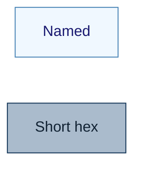

# Positive class color control

```mermaid
---
config:
  theme: base
  look: classic
---
flowchart LR
  COLOR_NAMED["Named"]
  COLOR_HEX["Short hex"]
  classDef nodeNamed fill:aliceblue,stroke:steelblue,color:midnightblue
  classDef nodeHex fill:#abc,stroke:#123456,color:#123
  class COLOR_NAMED nodeNamed
  class COLOR_HEX nodeHex
```
