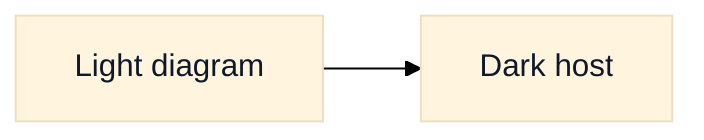

# Root selector probes

## Root selector svg

```mermaid
---
config:
  theme: base
  look: classic
  themeVariables:
    darkMode: false
    background: "#ffffff"
    primaryTextColor: "#0f172a"
  themeCSS: |
    svg {
      background-color: white !important;
    }
---
flowchart LR
  COLOR_A["Light diagram"]
  COLOR_B["Dark host"]
  COLOR_A --> COLOR_B
```

## Root selector :root

```mermaid
---
config:
  theme: base
  look: classic
  themeVariables:
    darkMode: false
    background: "#ffffff"
    primaryTextColor: "#0f172a"
  themeCSS: |
    :root {
      background-color: white !important;
    }
---
flowchart LR
  COLOR_A["Light diagram"]
  COLOR_B["Dark host"]
  COLOR_A --> COLOR_B
```

## Root selector &

```mermaid
---
config:
  theme: base
  look: classic
  themeVariables:
    darkMode: false
    background: "#ffffff"
    primaryTextColor: "#0f172a"
  themeCSS: |
    & {
      background-color: white !important;
    }
---
flowchart LR
  COLOR_A["Light diagram"]
  COLOR_B["Dark host"]
  COLOR_A --> COLOR_B
```
