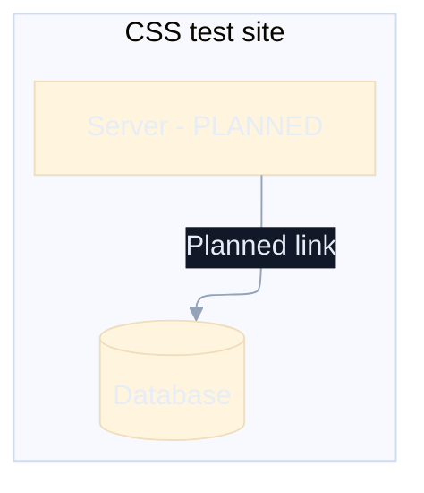

# Embedded CSS probe

```mermaid
---
config:
  theme: base
  look: classic
  layout: elk
  themeVariables:
    background: "#0b1120"
    primaryTextColor: "#e6edf7"
    lineColor: "#94a3b8"
    edgeLabelBackground: "#111827"
  themeCSS: |
    .node.nodeServer .label-container {
      fill: darkslategray !important;
      stroke: aquamarine !important;
      stroke-width: 3px !important;
    }
    .node.nodeServer .nodeLabel,
    .node.nodeServer text {
      color: honeydew !important;
      fill: honeydew !important;
    }
    .node.statePending .label-container {
      stroke-dasharray: 6 4 !important;
    }
    .cluster.groupSite rect {
      fill: midnightblue !important;
      stroke: lightslategray !important;
    }
    .cluster.groupSite .nodeLabel {
      color: white !important;
    }
    .flowchart-link[data-id="edge_probe_planned"] {
      stroke: gold !important;
      stroke-width: 3px !important;
      stroke-dasharray: 6 4 !important;
    }
    /* Layout helpers constrain ranks without becoming visible paths. */
    path[data-id^="layout_"] {
      opacity: 0 !important;
      visibility: hidden !important;
    }
---
%% Verify CSS classes without classDef and a named edge by data-id.
flowchart TB
  subgraph SG_PROBE["CSS test site"]
    PROBE_SERVER["Server - PLANNED"]
    PROBE_STORAGE[("Database")]
  end
  PROBE_SERVER edge_probe_planned@-->|"Planned link"| PROBE_STORAGE
  %% Verification fixture: parallel invisible constraint, not a second service path.
  PROBE_SERVER layout_probe_server_storage@~~~ PROBE_STORAGE
  class PROBE_SERVER,PROBE_STORAGE nodeServer
  class PROBE_SERVER statePending
  class SG_PROBE groupSite
```
