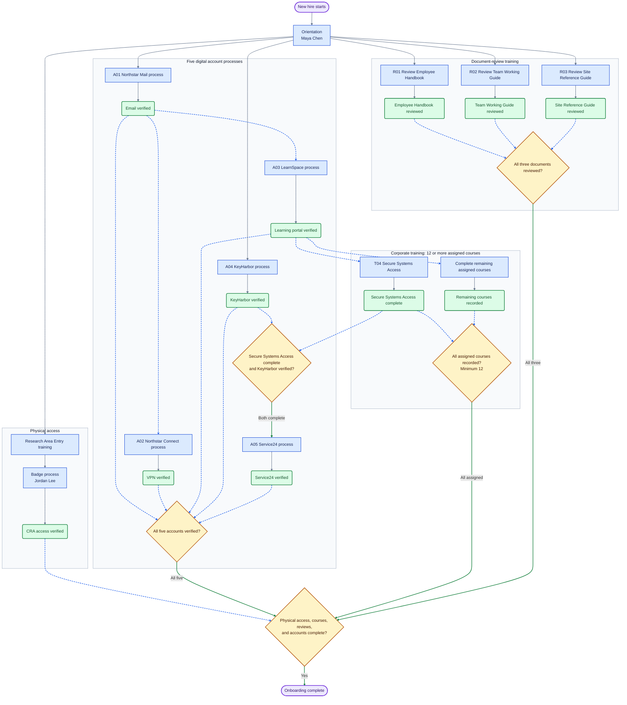
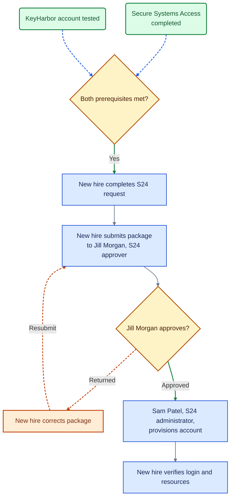

# New Hire Orientation and Access Guide

> **Fictional sample — Northstar Research.** Names, systems, courses, contacts, dates, and procedures below are illustrative. Links and email addresses use the reserved `.example` domain and are not working services. Replace sample details and validate the process before operational use.

| Document control | Value |
|---|---|
| Status | Fictional sample — not an approved procedure |
| Document owner | Maya Chen — Onboarding Coordinator |
| Example review date | 2026-09-23 — illustrative only; no organizational review performed |
| Example document location | [Northstar onboarding guide](https://people.northstar.example/onboarding/guide) |

This sample guide tracks orientation, Controlled Research Area (CRA) badge access, a minimum of 12 corporate training courses, three document-review training paths, and five digital accounts. Each account has its own request, approval, provisioning, and verification process. Badge access is separate from the five accounts. The course register can grow without adding a node for every course to the overview.

**Sample dependencies:** Corporate email enables the learning portal and VPN requests. The learning portal enables corporate training. Secure Systems Access and an operational KeyHarbor account enable the Service24 request; the remaining corporate courses are required at final completion. CRA training is a separate instructor-led course and can proceed alongside digital account setup. The three document reviews can start after orientation using copies supplied by Maya Chen; they require no account, course enrollment, assessment, or approval and do not block account requests. These are fictional process assumptions, not confirmed organizational requirements.

## Linked Section Index

| Workstream | Instruction sections |
|---|---|
| Overview | [Workflow](#onboarding-workflow) · [Diagram Legend](#diagram-legend) · [Terms and Course Names](#terms-and-course-names) |
| Start | [How to Use This Guide](#how-to-use-this-guide) · [New Hire Orientation](#new-hire-orientation) · [Who Does What](#who-does-what) |
| CRA badge | [CRA Training](#cra-training) · [CRA Badge Access](#cra-badge-access) · [CRA Access Verification](#cra-access-verification) |
| Required training | [Corporate Training Register](#corporate-training-register) · [Workplace Safety](#workplace-safety) · [Data Privacy](#data-privacy) · [Code of Conduct](#code-of-conduct) · [Secure Systems Access](#secure-systems-access) |
| Document reviews | [Review Instructions](#document-review-training) · [Employee Handbook](#employee-handbook-review) · [Team Working Guide](#team-working-guide-review) · [Site Reference Guide](#site-reference-guide-review) |
| Accounts | [Account Register](#account-register) · [Corporate Email](#corporate-email-account) · [VPN](#vpn-account) · [Learning Portal](#learning-portal-account) · [KeyHarbor](#password-manager-account) |
| S24 | [S24 Prerequisites](#s24-prerequisites) · [S24 Account Request](#s24-account-request) · [S24 Access Package](#s24-access-package) · [S24 Approval](#s24-approval) · [S24 Provisioning](#s24-provisioning) · [S24 Access Verification](#s24-access-verification) |
| Finish | [Final Onboarding Verification](#final-onboarding-verification) · [Example Resources and Contacts](#example-resources-and-contacts) |
| Maintainers | [Maintainer Notes](#maintainer-notes) |

## Terms and Course Names

These fictional names are used consistently in the diagrams and instructions. Course IDs appear in the [Corporate Training Register](#corporate-training-register); account IDs appear in the [Account Register](#account-register).

| Identifier | Sample name |
|---|---|
| CRA | Controlled Research Area |
| A01 | Northstar Mail — corporate email |
| A02 | Northstar Connect — VPN |
| A03 | LearnSpace — learning portal |
| A04 | KeyHarbor — password manager |
| A05 / S24 | Service24 — service operations portal |

## How to Use This Guide

Open this file with VS Code’s **Open Preview** or **Open Preview to the Side**. Use the section index for navigation; the diagrams are visual references.

In this sample, Maya Chen creates a new hire record in the [LaunchPad onboarding tracker](https://people.northstar.example/launchpad). LaunchPad is the single completion record; the shared guide remains the reference copy.

Use the section checklists as instructions and the final checklist as a review of that same completion record. Do not maintain a second independent set of completion records. For a local walkthrough, use a personal copy instead of the fictional tracker and edit its Markdown checkboxes in the source. Reconcile the final checklist against those section entries.

For each requirement, record its status (not started, in progress, awaiting another owner, blocked, or complete), current owner, completion date, and evidence or ticket reference in the chosen record. Record the blocker and next follow-up when work cannot proceed. Never record authentication secrets.

## Onboarding Workflow

The overview shows the five account processes, the corporate training program, three independent document reviews, and CRA badge access. Account boxes summarize the detailed procedures linked in the [Account Register](#account-register); a process reaches its verified milestone only after its access checks pass. The training program contains 12 sample courses and must include any additional assigned courses before closure. Document reviews are additional requirements and do not count toward the 12-course minimum.

All incoming requirements at each gate must be complete. Dashed arrows show prerequisites, not optional paths. Use the [section index](#linked-section-index) to open instructions; diagram shapes are not hyperlinks.

### Diagram Legend

The diagrams use the same visual conventions. Completion colors describe the condition represented by a node, not a live record of a new hire’s progress.

| Element | Appearance | Meaning |
|---|---|---|
| Start or finish | Purple stadium | Process boundary |
| Task | Blue rectangle | Action or processing step |
| Gate or decision | Amber diamond | Prerequisites or approval decision |
| Completed requirement | Green rounded rectangle | Completion or verified access required at this point |
| Correction task | Orange rectangle | Correct a returned package |
| Workstream | Light gray container | Related activities |
| Sequence | Solid gray arrow | Next step |
| Required input | Dashed blue arrow | Requirement feeding a gate; all incoming requirements must be met |
| Gate passed | Solid green arrow with a label | Proceed after prerequisites or approval |
| Rework | Dashed orange arrow with a label | Return for correction or resubmit |

## Who Does What

Alex Rivera is the backup S24 approver when Jill Morgan is unavailable.

| Activity | New hire's action | Next owner | Completion evidence |
|---|---|---|---|
| Orientation | Attend and review instructions | Maya Chen — Orientation coordinator | Orientation completion recorded |
| CRA training | Complete training | Owen Brooks — Training coordinator | Training completion recorded |
| CRA badge request | Submit completed forms after CRA training | Jordan Lee — Badge Office | Badge update confirmed |
| CRA verification | Test access | New hire; Jordan Lee — Badge Office if access fails | Successful badge test |
| Corporate training T01–T12 and additional assigned courses | Complete every assigned course | Owen Brooks — Training coordinator | Each completion recorded |
| Document reviews R01–R03 | Review each supplied document | New hire; Maya Chen supplies copies and records completion | Document title/version and review date recorded |
| Corporate email A01 | Confirm details and test mailbox | Maya Chen requests; Priya Shah provisions | Mailbox send/receive check passed |
| VPN A02 | Submit remote access request and test connection | Elena Park approves; Noah Reed provisions | VPN and sample intranet checks passed |
| Learning portal A03 | Confirm enrollment and test access | Maya Chen sponsors; Owen Brooks provisions | Assigned course list visible |
| Password manager | Submit online form and test account after creation | Priya Shah — Account Services | Operational account confirmed |
| S24 request and package | Complete request and send package | Jill Morgan — S24 approver | Submission acknowledged or tracked |
| S24 approval | Respond to returned items if needed | Jill Morgan — S24 approver | Approval recorded |
| S24 provisioning | Wait for account creation | Sam Patel — S24 administrator | Account enabled or ready notice |
| S24 verification | Test login and required resources | New hire; Sam Patel — S24 administrator if access fails | Successful login and resource checks |

## New Hire Orientation

- [ ] Attend orientation and review applicable policies and procedures.
- [ ] Record where to obtain the official training and access forms.
- [ ] Identify the coordinator or supervisor who can resolve onboarding questions.

After orientation, start CRA training, the three document reviews, corporate email, and KeyHarbor setup. Once email works, request VPN and LearnSpace access. Begin corporate courses after LearnSpace access is verified; use the prerequisite gates to determine when Service24 can proceed.

[Back to workflow](#onboarding-workflow)

## CRA Training

The sample course is **Research Area Entry**, coordinated by Owen Brooks.

- [ ] Enroll in and complete CRA training.
- [ ] Confirm completion is recorded; retain evidence if the badge request requires it.

**Dependency:** CRA training must be complete before the badge access request proceeds.

[Back to workflow](#onboarding-workflow)

## CRA Badge Access

- [ ] Obtain and complete the CRA badge access forms after CRA training.
- [ ] Submit the forms to the designated Badge Office process.
- [ ] Track the request while the Badge Office processes it.
- [ ] If the forms are returned, correct and resubmit them.
- [ ] Confirm the badge update has been applied.

A submitted request is awaiting processing; it is not yet verified access.

[Back to workflow](#onboarding-workflow)

## CRA Access Verification

- [ ] Test the updated badge at an authorized CRA access point using the organization's approved procedure.
- [ ] Record successful access without including badge credentials or sensitive identifiers.
- [ ] If access fails, report the issue to the Badge Office and retest after correction.

[Back to workflow](#onboarding-workflow)

## Corporate Training Register

The sample baseline is **12 corporate courses**. Owen Brooks confirms the full assignment list in LearnSpace; add any additional required courses here and in LaunchPad. Completing 12 courses does not close training if further courses are assigned. Research Area Entry and the three document reviews are separate and do not count toward this corporate minimum.

**Prerequisite for all corporate courses:** A03 LearnSpace verified. For each course, enroll using its catalog link, complete the content and assessment, and confirm that LearnSpace records completion. Retain the certificate or transcript reference in LaunchPad. Contact Owen Brooks if a course is missing, an assessment needs a retry, or a completion is not recorded.

| ID | Course | Sample enrollment | Completion evidence | Additional dependency |
|---|---|---|---|---|
| T01 | [Workplace Safety](#workplace-safety) | [SAFE-101](https://learn.northstar.example/courses/safe-101) | LearnSpace completion record | Required at final onboarding verification |
| T02 | [Data Privacy](#data-privacy) | [PRIV-102](https://learn.northstar.example/courses/priv-102) | LearnSpace completion record | Required at final onboarding verification |
| T03 | [Code of Conduct](#code-of-conduct) | [ETH-103](https://learn.northstar.example/courses/eth-103) | LearnSpace completion record | Required at final onboarding verification |
| T04 | [Secure Systems Access](#secure-systems-access) | [SEC-201](https://learn.northstar.example/courses/sec-201) | LearnSpace completion record | Required before A05 Service24 request |
| T05 | Phishing Awareness | [SEC-105](https://learn.northstar.example/courses/sec-105) | LearnSpace completion record | Required at final onboarding verification |
| T06 | Records Management | [REC-106](https://learn.northstar.example/courses/rec-106) | LearnSpace completion record | Required at final onboarding verification |
| T07 | Workplace Respect | [HR-107](https://learn.northstar.example/courses/hr-107) | LearnSpace completion record | Required at final onboarding verification |
| T08 | Emergency Preparedness | [SAFE-108](https://learn.northstar.example/courses/safe-108) | LearnSpace completion record | Required at final onboarding verification |
| T09 | Acceptable Use | [IT-109](https://learn.northstar.example/courses/it-109) | LearnSpace completion record | Required at final onboarding verification |
| T10 | Incident Reporting | [SEC-110](https://learn.northstar.example/courses/sec-110) | LearnSpace completion record | Required at final onboarding verification |
| T11 | Business Continuity | [OPS-111](https://learn.northstar.example/courses/ops-111) | LearnSpace completion record | Required at final onboarding verification |
| T12 | Information Classification | [DATA-112](https://learn.northstar.example/courses/data-112) | LearnSpace completion record | Required at final onboarding verification |

Course-specific notes follow for T01–T04. The common procedure above also applies to T05–T12 and additional assigned courses.

[Back to workflow](#onboarding-workflow)

## Workplace Safety

- [ ] Enroll, complete Workplace Safety, and confirm completion is recorded.

Workplace Safety is required for overall onboarding under this draft. It does not block the S24 request.

[Back to workflow](#onboarding-workflow)

## Data Privacy

- [ ] Enroll, complete Data Privacy, and confirm completion is recorded.

Data Privacy is required for overall onboarding under this draft. It does not block the S24 request.

[Back to workflow](#onboarding-workflow)

## Code of Conduct

- [ ] Enroll, complete Code of Conduct, and confirm completion is recorded.

Code of Conduct is required for overall onboarding under this draft. It does not block the S24 request.

[Back to workflow](#onboarding-workflow)

## Secure Systems Access

- [ ] Enroll in and complete Secure Systems Access.
- [ ] Confirm completion is recorded and retain documentation needed for S24.

**Dependency:** Secure Systems Access must be complete before proceeding with the S24 account request. It may run alongside the other training and CRA activities.

[Back to workflow](#onboarding-workflow)

## Document-Review Training

These three independent paths require only review of the respective document. Start after orientation and complete them in any order, alongside account setup and other training. Maya Chen supplies the current copies in the orientation packet so the reviews do not depend on email, LearnSpace, VPN, or another account.

There is no enrollment, quiz, certificate, or approval step. Once a document is reviewed, tell Maya its title/version and the review date so she can record completion in LaunchPad. In a local walkthrough, mark the corresponding checkbox in your personal copy. These records document completion; they are not an additional training activity.

The links below are fictional document references. Use the copies supplied in the orientation packet. If a copy is missing or unreadable, ask Maya for a replacement and leave that review incomplete until you can review it.

### Employee Handbook Review

**R01 — Employee Handbook.** Review the sample handbook describing workplace expectations, leave procedures, and employee support contacts.

- [ ] Review the [Northstar Employee Handbook](https://people.northstar.example/documents/employee-handbook).

**Complete when:** The document has been reviewed; record its version and review date. No account request depends on this review.

### Team Working Guide Review

**R02 — Team Working Guide.** Review the sample guide describing team responsibilities, routine communication, and handoff expectations.

- [ ] Review the [Northstar Team Working Guide](https://people.northstar.example/documents/team-working-guide).

**Complete when:** The document has been reviewed; record its version and review date. No account request depends on this review.

### Site Reference Guide Review

**R03 — Site Reference Guide.** Review the sample guide describing site layout, shared facilities, and visitor arrangements.

- [ ] Review the [Northstar Site Reference Guide](https://people.northstar.example/documents/site-reference-guide).

**Complete when:** The document has been reviewed; record its version and review date. This does not replace Research Area Entry training or the badge access test.

[Back to workflow](#onboarding-workflow)

## Account Register

These are the five digital accounts required in this sample. Track each account separately in LaunchPad, including request reference, approval, provisioning, and verification. An account-created notice is not evidence that its access test passed.

| ID | Account and process | Prerequisites | Request and approval | Provisioning owner | Verified when |
|---|---|---|---|---|---|
| A01 | [Northstar Mail](#corporate-email-account) | Orientation complete | Maya Chen submits employee details; Elena Park confirms them | Priya Shah | Send/receive test passes |
| A02 | [Northstar Connect VPN](#vpn-account) | A01 verified | New hire submits remote access request; Elena Park approves scope | Noah Reed | VPN connection and sample intranet access pass |
| A03 | [LearnSpace](#learning-portal-account) | A01 verified | Maya Chen sponsors enrollment; Owen Brooks confirms the course plan | Owen Brooks | Login works and all assigned courses are visible |
| A04 | [KeyHarbor](#password-manager-account) | Orientation complete | New hire submits KH-01; Elena Park approves vault assignment | Priya Shah | Login and sample vault entry test pass |
| A05 | [Service24](#s24-prerequisites) | T04 complete and A04 verified | New hire submits S24 package; Jill Morgan approves, with Alex Rivera as backup | Sam Patel | S24-CHK-01 checks pass |

LaunchPad is the coordinator-managed record in this sample, not a sixth new-hire account. Maya Chen records updates supplied by the new hire until the organization chooses a real tracker and access model. CRA badge access is physical access and is tracked separately.

## Corporate Email Account

**A01 — Northstar Mail.** Start after orientation. Maya Chen submits [MAIL-01](https://accounts.northstar.example/forms/mail-01) with the new hire’s name, start date, department, and manager.

- [ ] Confirm the submitted employee details with Maya Chen.
- [ ] Elena Park, the sample hiring manager, confirms the department and mailbox request. Return incorrect details to Maya for correction before provisioning.
- [ ] Priya Shah creates the mailbox and provides activation instructions through the coordinator’s approved onboarding channel, which does not require the new mailbox to work first.
- [ ] Complete activation and sign in using the supplied procedure.
- [ ] Send a sample message to Maya and receive a reply. Record the successful test in LaunchPad through Maya.
- [ ] Report activation or delivery failures to Priya, retain the request reference, and repeat the failed test after correction.

**Completion evidence:** Mailbox send/receive test passed. This unlocks A02 VPN and A03 LearnSpace requests.

[Back to account register](#account-register)

## VPN Account

**A02 — Northstar Connect.** Start after A01 is verified. Submit [VPN-01](https://accounts.northstar.example/forms/vpn-01) with the corporate email address, assigned device reference, and remote access purpose.

- [ ] Obtain Elena Park’s approval of the requested remote access scope. Correct and resubmit any returned request.
- [ ] Noah Reed, the network administrator, creates the VPN profile and supplies the approved client and enrollment procedure.
- [ ] Enroll the assigned device using Noah’s instructions.
- [ ] Connect to the VPN and open the sample [Northstar intranet](https://intranet.northstar.example). Disconnect and reconnect successfully.
- [ ] Record the result and request reference. If connection or resource access fails, contact Noah and retest after correction.

**Completion evidence:** VPN connection and sample intranet checks passed. VPN is required at final completion; it does not block LearnSpace or Service24 in this sample.

[Back to account register](#account-register)

## Learning Portal Account

**A03 — LearnSpace.** Start after A01 is verified. Maya Chen submits [LMS-01](https://accounts.northstar.example/forms/lms-01) with the corporate email address and assigned onboarding program.

- [ ] Owen Brooks checks the course plan against the corporate training register and any role-specific additions. Return incorrect program assignments to Maya before enrollment.
- [ ] Owen creates the learning account, assigns the courses, and sends the activation notice to the corporate mailbox.
- [ ] Activate the account and sign in to LearnSpace.
- [ ] Confirm that every assigned course is visible and that a course can be opened.
- [ ] Report missing courses or login failures to Owen and retest after correction.
- [ ] Record the successful portal check before beginning corporate training.

**Completion evidence:** Portal login works and the full assignment list is visible. Account verification does not mean the courses are complete; each course has its own completion record.

[Back to account register](#account-register)

## Password Manager Account

**A04 — KeyHarbor.** Start after orientation. Submit [KH-01](https://accounts.northstar.example/forms/kh-01) through the coordinator-assisted request channel so that a working email account is not a prerequisite.

- [ ] State the assigned team and requested vault in KH-01.
- [ ] Elena Park approves the vault assignment. Correct and resubmit any returned request.
- [ ] Priya Shah creates the account and provides activation instructions through Maya Chen’s onboarding channel.
- [ ] Activate and sign in using the supplied procedure.
- [ ] Open the assigned vault, save a dummy entry labeled Onboarding Practice, retrieve it, and remove the dummy entry after the test.
- [ ] Report account or vault problems to Priya and repeat the test after correction.
- [ ] Record only the result and request reference in LaunchPad through Maya.

**Completion evidence:** Account login and sample vault entry test passed. Together with T04 Secure Systems Access, this unlocks the Service24 request. Never record passwords or recovery codes in this guide, an access package, or the tracker.

[Back to account register](#account-register)

## S24 Prerequisites

Confirm **both** conditions before proceeding:

| Prerequisite | Evidence | Complete |
|---|---|:---:|
| Secure Systems Access completed | Training record or required completion document | ☐ |
| Password manager account created and operational | Account ready notice and successful test | ☐ |

If either condition is missing, continue that workstream and return to this gate when it is complete. The other corporate courses, document reviews, VPN, and CRA access are checked at final onboarding verification; they are not direct S24 prerequisites in this sample. Email and LearnSpace are upstream dependencies because they enable T04 training.

### S24 Handoff and Rework Detail

This track involves several handoffs. Each step remains pending until the next owner completes their action. A returned package goes back for correction and resubmission; approval must precede provisioning.

[Back to workflow](#onboarding-workflow)

## S24 Account Request

- [ ] Obtain and complete the official S24 account request form after both prerequisites are met.
- [ ] Provide Secure Systems Access evidence if the form requires it.
- [ ] Check the request for completeness and accuracy.

Prepare the request for inclusion in the approval package.

[Back to workflow](#onboarding-workflow)

## S24 Access Package

- [ ] Include the completed S24 account request.
- [ ] Include the password manager request or account information required by the approval process, without authentication secrets.
- [ ] Include Secure Systems Access evidence and other required supporting documents.
- [ ] Review the package for completeness.
- [ ] Submit the S24 request and password manager information **together** to the S24 approver through the approved channel.
- [ ] Record submission status or acknowledgment.

[Back to workflow](#onboarding-workflow)

## S24 Approval

Jill Morgan, the S24 approver, reviews the submitted package. If Jill is unavailable, use backup approver Alex Rivera through the same approval queue. Approval is a separate step from account provisioning.

- [ ] Record S24 approval before S24 provisioning begins.
- [ ] If the package is returned, identify the missing or incorrect information, correct it, and resubmit the package.
- [ ] Track the approval decision; submission alone does not grant access.

[Back to workflow](#onboarding-workflow)

## S24 Provisioning

After the S24 approver approves the package, the S24 administrator creates or enables the S24 account and communicates that it is ready for testing.

- [ ] Confirm approval has been recorded.
- [ ] Track provisioning until the account ready notice is received.
- [ ] If the account is delayed, follow up with the S24 administrator using the approved support channel.

[Back to workflow](#onboarding-workflow)

## S24 Access Verification

Sam Patel maintains the sample checklist **S24-CHK-01**. The checks below apply to the fictional Service24 training environment; use only its sample records. Successful login alone is insufficient.

| Required check | Pass criterion |
|---|---|
| Account login | The new hire can sign in to the intended S24 account through the approved authentication process. |
| Assigned resources and permissions | The Service Desk dashboard and Training Queue open, and the Knowledge Library allows read access under the Service Desk Trainee role. |
| Approved task checks | Create a ticket titled Onboarding Practice in the Training Queue, add a sample note, and close it. The ticket history shows all three actions; no production records are changed. |
| Password manager use | Follow sample procedure KH-02 to save and retrieve the S24 training-account entry in the assigned KeyHarbor vault. Record only pass/fail, never the secret. |

- [ ] Sign in to S24 using the approved authentication process.
- [ ] Perform each check in the approved S24 access checklist listed in [Example Resources and Contacts](#example-resources-and-contacts) and record the result.
- [ ] Confirm that the password manager is used as required.
- [ ] If login or authorization fails, contact the S24 administrator and repeat the check after resolution.

Record each check’s result, verification date, and any support ticket reference in the chosen completion record. Mark S24 access complete only after every applicable check passes.

[Back to workflow](#onboarding-workflow)

## Final Onboarding Verification

Onboarding is complete when **every** required item below has been verified. A request submission, approval, or ready notice alone does not substitute for the corresponding access test.

| Requirement | Completion evidence | Verified in chosen record |
|---|---|:---:|
| Orientation | Completion recorded | ☐ |
| CRA training | Research Area Entry completion recorded separately from corporate training | ☐ |
| CRA badge access | Badge updated and access tested | ☐ |
| Corporate training | T01–T12 and every additional assigned course completed; Owen Brooks reconciled LearnSpace and LaunchPad | ☐ |
| R01 Employee Handbook | Document version and review date recorded | ☐ |
| R02 Team Working Guide | Document version and review date recorded | ☐ |
| R03 Site Reference Guide | Document version and review date recorded | ☐ |
| A01 Northstar Mail | Approval and provisioning recorded; send/receive test passed | ☐ |
| A02 Northstar Connect | Approval and provisioning recorded; VPN and intranet checks passed | ☐ |
| A03 LearnSpace | Course plan and enrollment recorded; portal and assignment checks passed | ☐ |
| A04 KeyHarbor | Vault approval and provisioning recorded; login and sample entry test passed | ☐ |
| A05 Service24 | Package, approval, and provisioning recorded; S24-CHK-01 checks passed | ☐ |

For any incomplete item, identify its current owner, resolve or follow up on it, and recheck the final list. Have the onboarding coordinator review the evidence in the chosen completion record and record closure through the organization’s approved process.

[Back to workflow](#onboarding-workflow)

## Example Resources and Contacts

All entries below are fictional examples. The `.example` links and addresses are placeholders for the corresponding real organizational services.

| Resource or role | Sample name, link, or contact |
|---|---|
| Orientation instructions | [Welcome to Northstar](https://people.northstar.example/orientation) |
| Onboarding coordinator and completion record | Maya Chen — `maya.chen@northstar.example`; [LaunchPad tracker](https://people.northstar.example/launchpad) |
| Training coordinator / LearnSpace administrator | Owen Brooks — `learning@northstar.example` |
| Hiring manager / account sponsor | Elena Park — `elena.park@northstar.example` |
| VPN administrator | Noah Reed — `network-support@northstar.example` |
| Corporate email request | [MAIL-01](https://accounts.northstar.example/forms/mail-01) |
| VPN request | [VPN-01](https://accounts.northstar.example/forms/vpn-01) |
| LearnSpace request | [LMS-01](https://accounts.northstar.example/forms/lms-01) |
| Document-review packet | Maya Chen supplies current copies; [review instructions and document references](#document-review-training) |
| Corporate course catalog | [Training register](#corporate-training-register) — all course enrollment links |
| CRA training | [Research Area Entry](https://learn.northstar.example/courses/research-area-entry) |
| CRA badge forms | [CRA-01 badge request](https://access.northstar.example/forms/cra-01) — submit to the Badge Office |
| Workplace Safety | [Course SAFE-101](https://learn.northstar.example/courses/safe-101) |
| Data Privacy | [Course PRIV-102](https://learn.northstar.example/courses/priv-102) |
| Code of Conduct | [Course ETH-103](https://learn.northstar.example/courses/eth-103) |
| Secure Systems Access | [Course SEC-201](https://learn.northstar.example/courses/sec-201) — attach the completion certificate to the S24 package |
| Password manager request | [KeyHarbor account request KH-01](https://accounts.northstar.example/forms/kh-01) |
| Password manager procedure for S24 | [KeyHarbor procedure KH-02](https://help.northstar.example/keyharbor/kh-02) |
| S24 request | [Service24 request S24-01](https://accounts.northstar.example/forms/s24-01) |
| S24 access checklist | [S24-CHK-01](https://help.northstar.example/service24/checklist) — sample checks also appear under [S24 Access Verification](#s24-access-verification) |
| Badge Office | Jordan Lee — `badges@northstar.example` |
| Account Services | Priya Shah — `accounts@northstar.example` |
| S24 approver | Jill Morgan — [S24 approval queue](https://accounts.northstar.example/approvals/s24) |
| Backup S24 approver | Alex Rivera — same approval queue when Jill is unavailable |
| S24 administrator or support | Sam Patel — `service24-support@northstar.example` |

## Maintainer Notes

Before operational release, replace all fictional names, dates, `.example` URLs, contact addresses, course titles, and test procedures with validated organizational details. Confirm the dependencies with the responsible owners and record the actual document owner, process review date, and official copy location. A wording or formatting edit does not constitute a process review.

### Adding Future Activities

Assign additional corporate courses the next available T ID and add their enrollment, evidence, and dependency details to the training register. Reconcile the total assignment list at closure; keep the overview’s “12 or more” training group rather than drawing every course. Add a specific course node only when it unlocks another process.

For additional document reviews, use the next R ID, link the document, and add its independent review path and final checklist entry. Keep review-only activities separate from the corporate course count and do not add assessments or approval steps unless the real process requires them.

For an additional account, add an A ID, a register row, and a dedicated procedure covering prerequisites, request, approval, provisioning, verification, and returned or failed work. Update the overview’s account gate, final checklist, owner table, and total count together. Never count the tracker or physical badge as an extra digital account without explicitly changing the scope.

Add a new item to an existing track when it is another task, form, course, handoff, or verification step in that track. Give it its own track when it can progress independently **and** needs a distinct owner, status, or completion gate. Keep responsibility in the owner table even when work passes between people within one track. If a track acquires several decisions or rework paths, add a detailed diagram in its section and keep this overview focused on the points where tracks meet.

When changing a diagram, assign every new node, container, and edge an appropriate class and keep the legend consistent. Preserve the top-down layout. Update the section index and owner table when adding or renaming sections, and verify the Markdown section links in VS Code’s preview.
