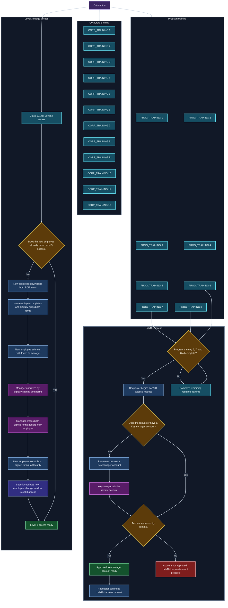

```mermaid
%%{init: {
  "theme": "base",
  "themeVariables": {
    "darkMode": true,
    "background": "#0f172a",
    "primaryColor": "#1e293b",
    "primaryTextColor": "#f8fafc",
    "primaryBorderColor": "#94a3b8",
    "lineColor": "#cbd5e1",
    "textColor": "#f8fafc",
    "clusterBkg": "#111827",
    "clusterBorder": "#64748b",
    "titleColor": "#f8fafc",
    "edgeLabelBackground": "#1e293b"
  }
}}%%
flowchart TB
    %% Edit quoted labels to change displayed text; keep IDs stable for connections.
    %% Connections stay within their groups to preserve the established layout.
    ORIENTATION["Orientation"]

    subgraph SG_LEVEL3_ACCESS["Level 3 badge access"]
        LEVEL3_COURSE_101["Class 101 for Level 3 access"]
        LEVEL3_HAS_ACCESS{"Does the new employee already have Level 3 access?"}
        LEVEL3_DOWNLOAD_FORMS["New employee downloads both PDF forms"]
        LEVEL3_SIGN_FORMS["New employee completes and digitally signs both forms"]
        LEVEL3_SUBMIT_MANAGER["New employee submits both forms to manager"]
        LEVEL3_MANAGER_APPROVAL["Manager approves by digitally signing both forms"]
        LEVEL3_RETURN_FORMS["Manager emails both signed forms back to new employee"]
        LEVEL3_SUBMIT_SECURITY["New employee sends both signed forms to Security"]
        LEVEL3_UPDATE_BADGE["Security updates new employee's badge to allow Level 3 access"]
        LEVEL3_ACCESS_READY["Level 3 access ready"]

        LEVEL3_COURSE_101 --> LEVEL3_HAS_ACCESS
        LEVEL3_HAS_ACCESS -->|No| LEVEL3_DOWNLOAD_FORMS
        LEVEL3_HAS_ACCESS -->|Yes| LEVEL3_ACCESS_READY
        LEVEL3_DOWNLOAD_FORMS --> LEVEL3_SIGN_FORMS --> LEVEL3_SUBMIT_MANAGER
        LEVEL3_SUBMIT_MANAGER --> LEVEL3_MANAGER_APPROVAL --> LEVEL3_RETURN_FORMS
        LEVEL3_RETURN_FORMS --> LEVEL3_SUBMIT_SECURITY --> LEVEL3_UPDATE_BADGE
        LEVEL3_UPDATE_BADGE --> LEVEL3_ACCESS_READY
    end

    subgraph SG_PROGRAM["Program training"]
        PROGRAM_COURSE_01["PROG_TRAINING 1"]
        PROGRAM_COURSE_02["PROG_TRAINING 2"]
        PROGRAM_COURSE_03["PROG_TRAINING 3"]
        PROGRAM_COURSE_04["PROG_TRAINING 4"]
        PROGRAM_COURSE_05["PROG_TRAINING 5"]
        PROGRAM_COURSE_06["PROG_TRAINING 6"]
        PROGRAM_COURSE_07["PROG_TRAINING 7"]
        PROGRAM_COURSE_08["PROG_TRAINING 8"]

        %% Two invisible chains create two columns, read across each row.
        %% Layout only: these links do not indicate completion order.
        PROGRAM_COURSE_01 layout_program_course_01_03@~~~ PROGRAM_COURSE_03 layout_program_course_03_05@~~~ PROGRAM_COURSE_05 layout_program_course_05_07@~~~ PROGRAM_COURSE_07
        PROGRAM_COURSE_02 layout_program_course_02_04@~~~ PROGRAM_COURSE_04 layout_program_course_04_06@~~~ PROGRAM_COURSE_06 layout_program_course_06_08@~~~ PROGRAM_COURSE_08
    end

    %% Lab101 applies to any requester, including existing employees.
    subgraph SG_LAB101["Lab101 access"]
        LAB101_TRAINING_COMPLETE{"Program training 6, 7, and 8 all complete?"}
        LAB101_WAIT["Complete remaining required training"]
        LAB101_REQUEST["Requester begins Lab101 access request"]
        LAB101_KEYMANAGER_HAS_ACCOUNT{"Does the requester have a Keymanager account?"}
        LAB101_KEYMANAGER_CREATE["Requester creates a Keymanager account"]
        LAB101_KEYMANAGER_REVIEW["Keymanager admins review account"]
        LAB101_KEYMANAGER_APPROVED{"Account approved by admins?"}
        LAB101_KEYMANAGER_READY["Approved Keymanager account ready"]
        LAB101_KEYMANAGER_NOT_APPROVED["Account not approved; Lab101 request cannot proceed"]
        %% Extend the request process here; this endpoint does not grant lab access.
        LAB101_CONTINUE["Requester continues Lab101 access request"]

        LAB101_TRAINING_COMPLETE -->|Yes| LAB101_REQUEST
        LAB101_TRAINING_COMPLETE -->|No| LAB101_WAIT
        LAB101_WAIT --> LAB101_TRAINING_COMPLETE
        LAB101_REQUEST --> LAB101_KEYMANAGER_HAS_ACCOUNT
        LAB101_KEYMANAGER_HAS_ACCOUNT -->|No| LAB101_KEYMANAGER_CREATE
        LAB101_KEYMANAGER_CREATE --> LAB101_KEYMANAGER_REVIEW --> LAB101_KEYMANAGER_APPROVED
        %% An existing account must also have approved status.
        LAB101_KEYMANAGER_HAS_ACCOUNT -->|Yes| LAB101_KEYMANAGER_APPROVED
        LAB101_KEYMANAGER_APPROVED -->|Yes| LAB101_KEYMANAGER_READY
        LAB101_KEYMANAGER_APPROVED -->|No| LAB101_KEYMANAGER_NOT_APPROVED
        LAB101_KEYMANAGER_READY --> LAB101_CONTINUE
    end

    %% ALL three courses are required. Update these edges and the decision label together.
    PROGRAM_COURSE_06 --> LAB101_TRAINING_COMPLETE
    PROGRAM_COURSE_07 --> LAB101_TRAINING_COMPLETE
    PROGRAM_COURSE_08 --> LAB101_TRAINING_COMPLETE

    %% Parallel tracks: training can proceed while badge access is pending.
    ORIENTATION --> LEVEL3_COURSE_101
    ORIENTATION --> SG_CORPORATE
    ORIENTATION --> SG_PROGRAM

    %% Use a named link text color: hex colors here caused a Mermaid parse error.
    %% Keep edge styling global; numeric edge indexes break when connections move.
    linkStyle default stroke:#cbd5e1,stroke-width:2px,color:whitesmoke;

    %% Layout: keep this block after the connections and other subgraphs.
    %% This ordering was rendered and checked with corporate training on the far left.
    %% Course lists do not imply an order; add arrows only for actual prerequisites.
    subgraph SG_CORPORATE["Corporate training"]
        CORPORATE_COURSE_01["CORP_TRAINING 1"]
        CORPORATE_COURSE_02["CORP_TRAINING 2"]
        CORPORATE_COURSE_03["CORP_TRAINING 3"]
        CORPORATE_COURSE_04["CORP_TRAINING 4"]
        CORPORATE_COURSE_05["CORP_TRAINING 5"]
        CORPORATE_COURSE_06["CORP_TRAINING 6"]
        CORPORATE_COURSE_07["CORP_TRAINING 7"]
        CORPORATE_COURSE_08["CORP_TRAINING 8"]
        CORPORATE_COURSE_09["CORP_TRAINING 9"]
        CORPORATE_COURSE_10["CORP_TRAINING 10"]
        CORPORATE_COURSE_11["CORP_TRAINING 11"]
        CORPORATE_COURSE_12["CORP_TRAINING 12"]
    end

    %% Shared palette: class names describe roles and outcomes, not live status.
    classDef nodeOrientation fill:#3b2563,stroke:#c4b5fd,color:#f5f3ff,stroke-width:2px;
    classDef nodeTrainingCourse fill:#164e63,stroke:#67e8f9,color:#ecfeff,stroke-width:2px;
    classDef nodeRequesterAction fill:#1e3a5f,stroke:#93c5fd,color:#eff6ff,stroke-width:2px;
    classDef nodeApproverAction fill:#581c67,stroke:#e879f9,color:#fdf4ff,stroke-width:2px;
    classDef nodeSecurityAction fill:#312e81,stroke:#a5b4fc,color:#eef2ff,stroke-width:2px;
    classDef nodeAccessDecision fill:#5c3b0a,stroke:#fcd34d,color:#fffbeb,stroke-width:2px;
    classDef nodeAccessReady fill:#14532d,stroke:#86efac,color:#f0fdf4,stroke-width:2px;
    classDef nodeAccessBlocked fill:#7f1d1d,stroke:#fca5a5,color:#fef2f2,stroke-width:2px;
    classDef groupWorkstream fill:#111827,stroke:#64748b,color:#f8fafc,stroke-width:2px;
    %% Keep layout helpers hidden under the global edge style.
    classDef layoutOnly opacity:0;

    %% Assign each new node to its semantic class here.
    class ORIENTATION nodeOrientation;
    class LEVEL3_COURSE_101,PROGRAM_COURSE_01,PROGRAM_COURSE_02,PROGRAM_COURSE_03,PROGRAM_COURSE_04,PROGRAM_COURSE_05,PROGRAM_COURSE_06,PROGRAM_COURSE_07,PROGRAM_COURSE_08,LAB101_WAIT,CORPORATE_COURSE_01,CORPORATE_COURSE_02,CORPORATE_COURSE_03,CORPORATE_COURSE_04,CORPORATE_COURSE_05,CORPORATE_COURSE_06,CORPORATE_COURSE_07,CORPORATE_COURSE_08,CORPORATE_COURSE_09,CORPORATE_COURSE_10,CORPORATE_COURSE_11,CORPORATE_COURSE_12 nodeTrainingCourse;
    class LEVEL3_HAS_ACCESS,LAB101_TRAINING_COMPLETE,LAB101_KEYMANAGER_HAS_ACCOUNT,LAB101_KEYMANAGER_APPROVED nodeAccessDecision;
    class LEVEL3_DOWNLOAD_FORMS,LEVEL3_SIGN_FORMS,LEVEL3_SUBMIT_MANAGER,LEVEL3_SUBMIT_SECURITY,LAB101_REQUEST,LAB101_KEYMANAGER_CREATE,LAB101_CONTINUE nodeRequesterAction;
    class LEVEL3_MANAGER_APPROVAL,LEVEL3_RETURN_FORMS,LAB101_KEYMANAGER_REVIEW nodeApproverAction;
    class LEVEL3_UPDATE_BADGE nodeSecurityAction;
    class LEVEL3_ACCESS_READY,LAB101_KEYMANAGER_READY nodeAccessReady;
    class LAB101_KEYMANAGER_NOT_APPROVED nodeAccessBlocked;
    class layout_program_course_01_03,layout_program_course_03_05,layout_program_course_05_07,layout_program_course_02_04,layout_program_course_04_06,layout_program_course_06_08 layoutOnly;
    class SG_LEVEL3_ACCESS,SG_CORPORATE,SG_PROGRAM,SG_LAB101 groupWorkstream;
```
