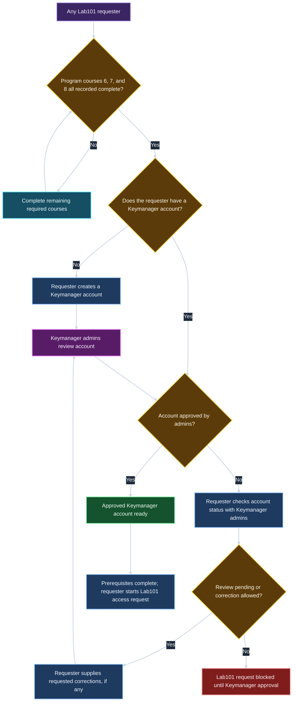

## Legend

| Element | Meaning |
|---|---|
| Rectangle | Action or outcome |
| Diamond | Decision; labeled arrows show its possible results |
| Purple | Entry point or manager/admin action |
| Cyan | Training activity |
| Blue | Requester action |
| Indigo | Security action |
| Amber | Decision |
| Green | Verified access or approved prerequisite |
| Red | Blocked request |

## Diagrams

### Corporate Training

This diagram should start after orientation has been completed. It can be done at the same time as program training.

### Program Training

This diagram should start after orientation has been completed. It can be done at the same time as corporate training.

### Floor 3 Badge Access

```mermaid
%%{init: {"theme":"base","themeVariables":{"darkMode":true,"background":"#0f172a","primaryTextColor":"#f8fafc","lineColor":"#cbd5e1","edgeLabelBackground":"#1e293b"}}}%%
flowchart TB
    ORIENTATION["Orientation"]
    LEVEL3_COURSE_101["Class 101 for Level 3 access"]
    LEVEL3_HAS_ACCESS{"Does the new employee already have Level 3 access?"}
    LEVEL3_DOWNLOAD_FORMS["New employee downloads both PDF forms"]
    LEVEL3_SIGN_FORMS["New employee completes and digitally signs both forms"]
    LEVEL3_SUBMIT_MANAGER["New employee submits both forms to manager"]
    LEVEL3_MANAGER_APPROVAL["Manager approves by digitally signing both forms"]
    LEVEL3_RETURN_FORMS["Manager emails both signed forms back to new employee"]
    LEVEL3_SUBMIT_SECURITY["New employee sends both signed forms to Security"]
    LEVEL3_UPDATE_BADGE["Security updates badge for Level 3 access"]
    LEVEL3_VERIFY_BADGE["New employee tests Level 3 badge access"]
    LEVEL3_ACCESS_WORKS{"Does Level 3 badge access work?"}
    LEVEL3_RESOLVE_ACCESS["Security investigates and resolves badge issue"]
    LEVEL3_ACCESS_READY["Level 3 access verified"]

    ORIENTATION --> LEVEL3_COURSE_101 --> LEVEL3_HAS_ACCESS
    LEVEL3_HAS_ACCESS -->|Yes| LEVEL3_VERIFY_BADGE
    LEVEL3_HAS_ACCESS -->|No| LEVEL3_DOWNLOAD_FORMS
    LEVEL3_DOWNLOAD_FORMS --> LEVEL3_SIGN_FORMS --> LEVEL3_SUBMIT_MANAGER
    LEVEL3_SUBMIT_MANAGER --> LEVEL3_MANAGER_APPROVAL --> LEVEL3_RETURN_FORMS
    LEVEL3_RETURN_FORMS --> LEVEL3_SUBMIT_SECURITY --> LEVEL3_UPDATE_BADGE
    LEVEL3_UPDATE_BADGE --> LEVEL3_VERIFY_BADGE --> LEVEL3_ACCESS_WORKS
    LEVEL3_ACCESS_WORKS -->|Yes| LEVEL3_ACCESS_READY
    LEVEL3_ACCESS_WORKS -->|No| LEVEL3_RESOLVE_ACCESS --> LEVEL3_VERIFY_BADGE

    classDef entry fill:#3b2563,stroke:#c4b5fd,color:#f5f3ff,stroke-width:2px;
    classDef training fill:#164e63,stroke:#67e8f9,color:#ecfeff,stroke-width:2px;
    classDef requester fill:#1e3a5f,stroke:#93c5fd,color:#eff6ff,stroke-width:2px;
    classDef approver fill:#581c67,stroke:#e879f9,color:#fdf4ff,stroke-width:2px;
    classDef security fill:#312e81,stroke:#a5b4fc,color:#eef2ff,stroke-width:2px;
    classDef decision fill:#5c3b0a,stroke:#fcd34d,color:#fffbeb,stroke-width:2px;
    classDef verified fill:#14532d,stroke:#86efac,color:#f0fdf4,stroke-width:2px;
    class ORIENTATION entry;
    class LEVEL3_COURSE_101 training;
    class LEVEL3_DOWNLOAD_FORMS,LEVEL3_SIGN_FORMS,LEVEL3_SUBMIT_MANAGER,LEVEL3_SUBMIT_SECURITY,LEVEL3_VERIFY_BADGE requester;
    class LEVEL3_MANAGER_APPROVAL,LEVEL3_RETURN_FORMS approver;
    class LEVEL3_UPDATE_BADGE,LEVEL3_RESOLVE_ACCESS security;
    class LEVEL3_HAS_ACCESS,LEVEL3_ACCESS_WORKS decision;
    class LEVEL3_ACCESS_READY verified;
    linkStyle default stroke:#cbd5e1,stroke-width:2px,color:whitesmoke;
```

### Lab101 Badge Access

This is very similar to section "Floor 3 Badge Access" but requires program training class 6, class 7, and class 8 to be completed before the user can add that access request to the same form used in "Floor 3 Badge Access". Floor 3 Badge access can occur (and be granted) before the employee files for Lab 101 Badge Access.

### Lab101 Account Request

