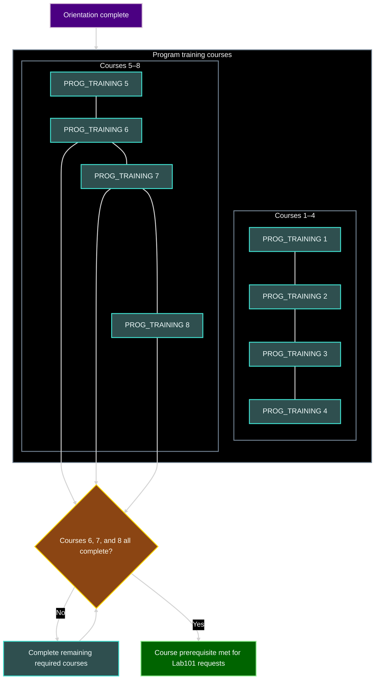
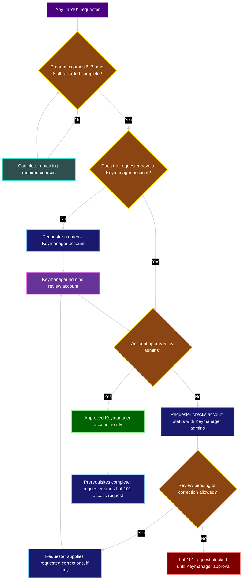

## Legend

| Element | Generic color | CSS named colors (fill / border) | Meaning |
|---|---|---|---|
| Rectangle | Varies | Varies by role | Action or outcome |
| Entry point | Purple | `indigo` / `thistle` | Start of a track |
| Training | Teal | `darkslategray` / `turquoise` | Course or training task |
| Requester | Blue | `midnightblue` / `lightskyblue` | Employee or requester action |
| Manager or admin | Purple | `rebeccapurple` / `violet` | Approval or account review |
| Security | Indigo | `darkslateblue` / `cornflowerblue` | Badge or Security action |
| Decision diamond | Amber | `saddlebrown` / `gold` | Question; labeled arrows show its possible results |
| Completed or ready | Green | `darkgreen` / `lightgreen` | Verified access, approved prerequisite, or completed training |
| Blocked | Red | `maroon` / `lightcoral` | Request cannot proceed |
| Course container | Black and gray | `black` / `slategray` | Groups courses in a training diagram |
| Arrow | Gray and white | `lightgray` line; `whitesmoke` label | Sequence or decision result |

## Diagrams

### Corporate Training

```mermaid
%%{init: {"theme":"base","themeVariables":{"darkMode":true,"background":"black","primaryTextColor":"whitesmoke","lineColor":"lightgray","edgeLabelBackground":"black"}}}%%
flowchart TB
    %% Edit quoted labels to change displayed text; keep IDs stable for connections.
    %% Course lists do not imply an order; add arrows only for actual prerequisites.
    CORPORATE_START["Orientation complete"]

    subgraph SG_CORPORATE["Corporate training courses"]
        direction TB
        CORPORATE_COURSE_01["CORP_TRAINING 1"]
        CORPORATE_COURSE_02["CORP_TRAINING 2"]
        CORPORATE_COURSE_03["CORP_TRAINING 3"]
        CORPORATE_COURSE_04["CORP_TRAINING 4"]
        CORPORATE_COURSE_05["CORP_TRAINING 5"]
        CORPORATE_COURSE_06["CORP_TRAINING 6"]
        CORPORATE_COURSE_07["CORP_TRAINING 7"]
        CORPORATE_COURSE_08["CORP_TRAINING 8"]
        CORPORATE_COURSE_09["CORP_TRAINING 9"]
        CORPORATE_COURSE_10["CORP_TRAINING 10"]
        CORPORATE_COURSE_11["CORP_TRAINING 11"]
        CORPORATE_COURSE_12["CORP_TRAINING 12"]
        %% Layout only: these invisible links do not indicate completion order.
        CORPORATE_COURSE_01 ~~~ CORPORATE_COURSE_02 ~~~ CORPORATE_COURSE_03 ~~~ CORPORATE_COURSE_04 ~~~ CORPORATE_COURSE_05 ~~~ CORPORATE_COURSE_06 ~~~ CORPORATE_COURSE_07 ~~~ CORPORATE_COURSE_08 ~~~ CORPORATE_COURSE_09 ~~~ CORPORATE_COURSE_10 ~~~ CORPORATE_COURSE_11 ~~~ CORPORATE_COURSE_12
    end

    %% Parallel tracks: training can proceed while badge access is pending.
    %% Corporate training has no dependency link to badge or Lab101 access.
    CORPORATE_START --> SG_CORPORATE
    SG_CORPORATE --> CORPORATE_DONE["All corporate training complete within one month of start date"]

    %% Shared palette: class names describe roles and outcomes, not live status.
    %% classDef format: fill (background), stroke (border), and color (text) use CSS named colors; stroke-width sets border thickness.
    classDef entry fill:indigo,stroke:thistle,color:ghostwhite,stroke-width:2px;
    classDef training fill:darkslategray,stroke:turquoise,color:azure,stroke-width:2px;
    classDef complete fill:darkgreen,stroke:lightgreen,color:mintcream,stroke-width:2px;
    classDef group fill:black,stroke:slategray,color:whitesmoke,stroke-width:2px;
    %% Assign each new node or container to its semantic class here.
    class CORPORATE_START entry;
    class CORPORATE_COURSE_01,CORPORATE_COURSE_02,CORPORATE_COURSE_03,CORPORATE_COURSE_04,CORPORATE_COURSE_05,CORPORATE_COURSE_06,CORPORATE_COURSE_07,CORPORATE_COURSE_08,CORPORATE_COURSE_09,CORPORATE_COURSE_10,CORPORATE_COURSE_11,CORPORATE_COURSE_12 training;
    class CORPORATE_DONE complete;
    class SG_CORPORATE group;
    %% Mermaid CLI 12.0.0 rejects hex in linkStyle color; use a CSS named color for link labels.
    %% CSS named color index: https://drafts.csswg.org/css-color/#named-colors
    %% Keep edge styling global; numeric edge indexes break when connections move.
    linkStyle default stroke:lightgray,stroke-width:2px,color:whitesmoke;
```

### Program Training

### Floor 3 Badge Access

```mermaid
%%{init: {"theme":"base","themeVariables":{"darkMode":true,"background":"black","primaryTextColor":"whitesmoke","lineColor":"lightgray","edgeLabelBackground":"black"}}}%%
flowchart TB
    %% Edit quoted labels to change displayed text; keep IDs stable for connections.
    ORIENTATION["Orientation"]
    LEVEL3_COURSE_101["Class 101 for Floor 3 access"]
    LEVEL3_HAS_ACCESS{"Does the new employee already have Floor 3 access?"}
    LEVEL3_DOWNLOAD_FORMS["New employee downloads both PDF forms"]
    LEVEL3_SIGN_FORMS["New employee completes and digitally signs both forms"]
    LEVEL3_SUBMIT_MANAGER["New employee submits both forms to manager"]
    LEVEL3_MANAGER_APPROVAL["Manager approves by digitally signing both forms"]
    LEVEL3_RETURN_FORMS["Manager emails both signed forms back to new employee"]
    LEVEL3_SUBMIT_SECURITY["New employee sends both signed forms to Security"]
    LEVEL3_UPDATE_BADGE["Security updates badge for Floor 3 access"]
    LEVEL3_VERIFY_BADGE["New employee tests Floor 3 badge access"]
    LEVEL3_ACCESS_WORKS{"Does Floor 3 badge access work?"}
    LEVEL3_RESOLVE_ACCESS["Security investigates and resolves badge issue"]
    LEVEL3_ACCESS_READY["Floor 3 access verified"]

    %% Both the existing-access path and new-badge path require an access test.
    ORIENTATION --> LEVEL3_COURSE_101 --> LEVEL3_HAS_ACCESS
    LEVEL3_HAS_ACCESS -->|Yes| LEVEL3_VERIFY_BADGE
    LEVEL3_HAS_ACCESS -->|No| LEVEL3_DOWNLOAD_FORMS
    LEVEL3_DOWNLOAD_FORMS --> LEVEL3_SIGN_FORMS --> LEVEL3_SUBMIT_MANAGER
    LEVEL3_SUBMIT_MANAGER --> LEVEL3_MANAGER_APPROVAL --> LEVEL3_RETURN_FORMS
    LEVEL3_RETURN_FORMS --> LEVEL3_SUBMIT_SECURITY --> LEVEL3_UPDATE_BADGE
    LEVEL3_UPDATE_BADGE --> LEVEL3_VERIFY_BADGE --> LEVEL3_ACCESS_WORKS
    LEVEL3_ACCESS_WORKS -->|Yes| LEVEL3_ACCESS_READY
    LEVEL3_ACCESS_WORKS -->|No| LEVEL3_RESOLVE_ACCESS --> LEVEL3_VERIFY_BADGE

    %% Shared palette: class names describe roles and outcomes, not live status.
    %% classDef format: fill (background), stroke (border), and color (text) use CSS named colors; stroke-width sets border thickness.
    classDef entry fill:indigo,stroke:thistle,color:ghostwhite,stroke-width:2px;
    classDef training fill:darkslategray,stroke:turquoise,color:azure,stroke-width:2px;
    classDef requester fill:midnightblue,stroke:lightskyblue,color:aliceblue,stroke-width:2px;
    classDef approver fill:rebeccapurple,stroke:violet,color:lavenderblush,stroke-width:2px;
    classDef security fill:darkslateblue,stroke:cornflowerblue,color:ghostwhite,stroke-width:2px;
    classDef decision fill:saddlebrown,stroke:gold,color:ivory,stroke-width:2px;
    classDef verified fill:darkgreen,stroke:lightgreen,color:mintcream,stroke-width:2px;
    %% Assign each new node to its semantic class here.
    class ORIENTATION entry;
    class LEVEL3_COURSE_101 training;
    class LEVEL3_DOWNLOAD_FORMS,LEVEL3_SIGN_FORMS,LEVEL3_SUBMIT_MANAGER,LEVEL3_SUBMIT_SECURITY,LEVEL3_VERIFY_BADGE requester;
    class LEVEL3_MANAGER_APPROVAL,LEVEL3_RETURN_FORMS approver;
    class LEVEL3_UPDATE_BADGE,LEVEL3_RESOLVE_ACCESS security;
    class LEVEL3_HAS_ACCESS,LEVEL3_ACCESS_WORKS decision;
    class LEVEL3_ACCESS_READY verified;
    %% Mermaid CLI 12.0.0 rejects hex in linkStyle color; use a CSS named color for link labels.
    %% CSS named color index: https://drafts.csswg.org/css-color/#named-colors
    %% Keep edge styling global; numeric edge indexes break when connections move.
    linkStyle default stroke:lightgray,stroke-width:2px,color:whitesmoke;
```

### Lab101 Badge Access

```mermaid
%%{init: {"theme":"base","themeVariables":{"darkMode":true,"background":"black","primaryTextColor":"whitesmoke","lineColor":"lightgray","edgeLabelBackground":"black"}}}%%
flowchart TB
    %% Edit quoted labels to change displayed text; keep IDs stable for connections.
    LAB101_BADGE_START["Employee seeks Lab101 badge access"]
    LAB101_BADGE_COURSES{"Program courses 6, 7, and 8 all complete?"}
    LAB101_BADGE_WAIT["Complete remaining required courses"]
    LAB101_BADGE_HAS_ACCESS{"Already have Lab101 badge access?"}
    LAB101_BADGE_FORM["Employee adds Lab101 to the shared Floor 3 badge access form"]
    LAB101_BADGE_SIGN["Employee completes and digitally signs the form"]
    LAB101_BADGE_SUBMIT_MANAGER["Employee submits form to manager"]
    LAB101_BADGE_MANAGER_SIGN["Manager approves and digitally signs form"]
    LAB101_BADGE_RETURN["Manager returns signed form to employee"]
    LAB101_BADGE_SEND_SECURITY["Employee sends signed form to Security"]
    LAB101_BADGE_UPDATE["Security updates badge for Lab101 access"]
    LAB101_BADGE_TEST["Employee tests Lab101 badge access"]
    LAB101_BADGE_WORKS{"Does Lab101 badge access work?"}
    LAB101_BADGE_RESOLVE["Security investigates and resolves badge issue"]
    LAB101_BADGE_READY["Lab101 badge access verified"]

    %% ALL three courses are required before the Lab101 badge request form is submitted.
    LAB101_BADGE_START --> LAB101_BADGE_COURSES
    LAB101_BADGE_COURSES -->|No| LAB101_BADGE_WAIT --> LAB101_BADGE_COURSES
    LAB101_BADGE_COURSES -->|Yes| LAB101_BADGE_HAS_ACCESS
    LAB101_BADGE_HAS_ACCESS -->|Yes| LAB101_BADGE_TEST
    LAB101_BADGE_HAS_ACCESS -->|No| LAB101_BADGE_FORM
    LAB101_BADGE_FORM --> LAB101_BADGE_SIGN --> LAB101_BADGE_SUBMIT_MANAGER
    LAB101_BADGE_SUBMIT_MANAGER --> LAB101_BADGE_MANAGER_SIGN --> LAB101_BADGE_RETURN
    LAB101_BADGE_RETURN --> LAB101_BADGE_SEND_SECURITY --> LAB101_BADGE_UPDATE
    LAB101_BADGE_UPDATE --> LAB101_BADGE_TEST --> LAB101_BADGE_WORKS
    LAB101_BADGE_WORKS -->|Yes| LAB101_BADGE_READY
    LAB101_BADGE_WORKS -->|No| LAB101_BADGE_RESOLVE --> LAB101_BADGE_TEST

    %% Shared palette: class names describe roles and outcomes, not live status.
    %% classDef format: fill (background), stroke (border), and color (text) use CSS named colors; stroke-width sets border thickness.
    classDef entry fill:indigo,stroke:thistle,color:ghostwhite,stroke-width:2px;
    classDef training fill:darkslategray,stroke:turquoise,color:azure,stroke-width:2px;
    classDef requester fill:midnightblue,stroke:lightskyblue,color:aliceblue,stroke-width:2px;
    classDef approver fill:rebeccapurple,stroke:violet,color:lavenderblush,stroke-width:2px;
    classDef security fill:darkslateblue,stroke:cornflowerblue,color:ghostwhite,stroke-width:2px;
    classDef decision fill:saddlebrown,stroke:gold,color:ivory,stroke-width:2px;
    classDef verified fill:darkgreen,stroke:lightgreen,color:mintcream,stroke-width:2px;
    %% Assign each new node to its semantic class here.
    class LAB101_BADGE_START entry;
    class LAB101_BADGE_WAIT training;
    class LAB101_BADGE_FORM,LAB101_BADGE_SIGN,LAB101_BADGE_SUBMIT_MANAGER,LAB101_BADGE_SEND_SECURITY,LAB101_BADGE_TEST requester;
    class LAB101_BADGE_MANAGER_SIGN,LAB101_BADGE_RETURN approver;
    class LAB101_BADGE_UPDATE,LAB101_BADGE_RESOLVE security;
    class LAB101_BADGE_COURSES,LAB101_BADGE_HAS_ACCESS,LAB101_BADGE_WORKS decision;
    class LAB101_BADGE_READY verified;
    %% Mermaid CLI 12.0.0 rejects hex in linkStyle color; use a CSS named color for link labels.
    %% CSS named color index: https://drafts.csswg.org/css-color/#named-colors
    %% Keep edge styling global; numeric edge indexes break when connections move.
    linkStyle default stroke:lightgray,stroke-width:2px,color:whitesmoke;
```

### Lab101 Account Request

